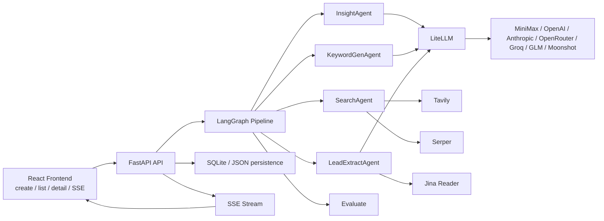
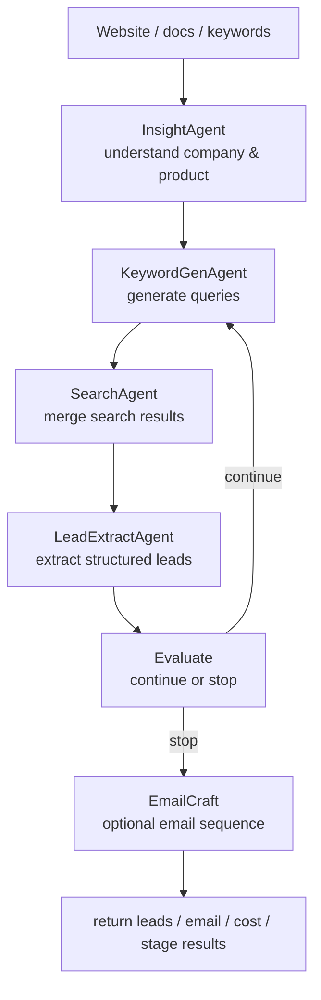

<h1 align="center">🎯 AI Hunter: B2B Lead-Hunting Agents</h1>

<p align="center">
  <strong>Today, outbound still depends on manual search 🧑💻. Tomorrow, a multi-agent pipeline does the hunting 🤖🤖🤖<br>
  AI Hunter: give it a website, product docs, or keywords — it understands the company, searches, extracts leads, finds contacts, and drafts outreach</strong>
</p>

<p align="center">
  <a href="#-quick-start"></a>
  <a href="#-use-cases"></a>
  <a href="#-features"></a>
  <a href="LICENSE"></a>
</p>

<p align="center">
  
  
  
  
  
</p>

**One sentence:** provide a company website, product documents, or keywords, pick a target market, and the system runs company understanding, keyword generation, web search, lead extraction, and contact discovery. &nbsp;&nbsp;[**中文文档**](README_CN.md)

<p align="center">
  Website: <a href="https://b2binsights.io/">b2binsights.io</a>
  · Open-source repo: <a href="https://github.com/xiongQvQ/AI_Find_Customer">xiongQvQ/AI_Find_Customer</a>
  · Intro video: <a href="https://www.bilibili.com/video/BV1AzwYzXEGD">Bilibili</a>
</p>

---

## 📰 News

**2026-08** The open-source edition now covers the main path: lead hunting + email draft generation + campaign auto-send.

**2026-08** UI and headless modes now share the same `producer / consumer` queue. They are no longer two split code paths.

**2026-08** Custom hunting is available via **Hermes + Skill** for teams that need a more flexible strategy.

---

## ✨ Core scenarios

<table align="center" width="100%">
<tr>
<td width="25%" align="center" style="vertical-align: top; padding: 15px;">

<h3>🌍 Trade outbound</h3>

<div align="center">
  
</div>

<p align="center"><strong>Website → leads</strong></p>

<p align="center">Give it a factory site or product keywords and find overseas distributors, wholesalers, and importers</p>

</td>
<td width="25%" align="center" style="vertical-align: top; padding: 15px;">

<h3>✉️ Outreach sequence</h3>

<div align="center">
  
</div>

<p align="center"><strong>Draft → review → send</strong></p>

<p align="center">Generate a 3-step English outreach sequence from ICP and site insights, then send only after human approval</p>

</td>
<td width="25%" align="center" style="vertical-align: top; padding: 15px;">

<h3>🖥️ Headless automation</h3>

<div align="center">
  
</div>

<p align="center"><strong>Hunt around the clock</strong></p>

<p align="center">Producer enqueues, consumer runs hunts, scheduler sends mail, Feishu reports progress and alerts</p>

</td>
<td width="25%" align="center" style="vertical-align: top; padding: 15px;">

<h3>🧩 Hermes + Skill</h3>

<div align="center">
  
</div>

<p align="center"><strong>Pluggable strategy</strong></p>

<p align="center">Hermes decides and writes queries; Skills wrap search, crawl, and scoring — compose on demand instead of a fixed pipeline</p>

</td>
</tr>
</table>

---

## 🤔 Why AI Hunter?

Finding B2B leads is not hard because people “cannot search”. It is hard because search has to become a **repeatable pipeline**: understand the product, generate keywords, crawl result pages, extract contacts, write outreach, and follow replies. Most of that is still copy-paste.

**What if agents ran that pipeline for you?**

AI Hunter splits hunting into specialized roles. You only provide:

- 🚀 **Input** — a website URL, product documents, or a few keywords
- 🎯 **Market** — target customer profile and regions
- ⚙️ **Bounds** — target lead count, max rounds, and minimum new leads per round

The system does the rest: understand the company, expand queries, search multiple channels, extract structured leads, optionally draft outreach, and stop when your explicit conditions are met.

---

## 🎯 Why a pipeline helps

<table>
<tr>
<td width="33%" valign="top">

### 🤖 Clear agent roles
`Insight → KeywordGen → Search → LeadExtract → Evaluate`. A reasoning model owns ReAct decisions; a faster model owns extraction, generation, and rewrites.

```text
InsightAgent     understand company & product
KeywordGenAgent  generate search queries
SearchAgent      merge multi-channel results
LeadExtractAgent extract structured leads
Evaluate         decide whether to continue
```

</td>
<td width="33%" valign="top">

### 🔎 Multi-channel search
Google Search, Google Maps, and B2B in-site search, then adaptive fetching by URL type.

```text
Tavily   general web search (multi-key rotation)
Serper   Google / Google Maps
Jina     website and article body reading
```

</td>
<td width="33%" valign="top">

### 👀 You review, then send
The UI shows the queue and hunt details. Email stays in draft until a human approves it into a campaign.

```bash
# Frontend
http://localhost:3000

# API / Swagger
http://127.0.0.1:8000/docs
```

</td>
</tr>
</table>

| | AI Hunter | Manual hunting / generic crawlers |
|---|---------|-----------------|
| 🎯 **Input** | Website, docs, or keywords | Humans invent queries and click pages |
| ⚡ **Execution** | Multi-agent loop until stop conditions | Copy-paste context between tools |
| 📇 **Output** | Structured leads (email / phone / address / social) | Hand-built spreadsheets |
| ✉️ **Outreach** | 3-step sequence + review + campaign send | Write and send by hand |
| 🖥️ **Deploy** | UI + VPS headless queue | Hard to keep running |
| 🔌 **Models** | LiteLLM for MiniMax / OpenAI / Anthropic and more | Locked to one vendor |

---

## 🎬 Use cases

### 🌍 1. A factory looking for overseas distributors

You tell the system: *"This is our micro-switch factory website. Target the US electrical distributor market."* **The pipeline searches and extracts on its own.**

```
Human input: website + product keywords + target region

🤖 AI Hunter:
├── 📖 InsightAgent reads the site / docs and infers product + ICP
├── 🔑 KeywordGenAgent writes English queries and in-site searches
├── 🔎 SearchAgent merges:
│   ├── Google / Tavily organic results
│   ├── Google Maps local distributors
│   └── B2B directory listing pages
├── 🧬 LeadExtractAgent dedupes by domain, then deep-fetches
│   └── company, email, phone, address, social
├── 📊 Evaluate checks target_lead_count / max_rounds / min_new_leads_threshold
│   ├── not done → another round with new queries
│   └── done → stop hunting
└── ✉️ optional EmailCraft: draft a 3-step sequence and wait for review
```

### 🏗️ 2. Submit from the UI, execute in the queue

The frontend no longer treats “New hunt” as a long request that blocks the browser. It creates an `automation job`; a consumer claims it and starts the real hunt.

```
Human: fill website, keywords, region, and email samples

🤖 What actually happens:
├── frontend creates an automation job
├── TemplateSeedWorker warms a template_seed
├── AutomationConsumer claims the job and creates a real hunt
├── hunt runs search / extract / evaluate / email generation
├── on completion it creates a campaign for EmailScheduler
└── dashboard shows queue status, recent companies, sends, and replies
```

### 💰 3. 24/7 headless outreach on a VPS

Use this when you want “prepare template → hunt → generate email → auto-send” to keep running. Each hunt has bounds; the queue keeps enqueueing.

```bash
python scripts/hunt_queue.py producer \
  --payload-file ./automation_job.json \
  --continuous \
  --enqueue-interval-seconds 60 \
  --max-pending-jobs 3
```

```
🤖 Then the system:
├── 📊 Producer writes the payload into SQLite hunt_jobs
├── 🌱 TemplateSeedWorker warms seeds for queued jobs
├── 🏃 AutomationConsumer claims and runs the hunt
├── 📬 completed sendable sequences land in email_messages
├── ⏰ EmailScheduler scans pending every 60 seconds and sends
└── 📥 EmailReply polls IMAP and stops follow-ups on a hit
```

---

## 📦 What this public repo includes

The public open-source tree keeps:

- `backend/`: FastAPI + LangGraph service
- `frontend/`: React + Vite UI
- required config examples and docs

These modules stay out of the public repo:

- `license-server/`
- `license-server-v2/`
- `landing/`

### Current version boundaries

- Auto-send should go through the `campaign / scheduler` path. Do not treat the hunt detail page as a full marketing-automation product.
- Sending depends on your own SMTP / IMAP, app passwords, and security policy. This repo never ships third-party mailbox accounts.
- Without `API_ACCESS_TOKEN`, non-localhost API access is denied by default.

---

## 🚀 Quick start

### ✅ Check first

- Python `3.11+`
- Node.js `18+` or Bun
- at least one LLM API key
- at least one search API key

### 1. Clone

```bash
git clone https://github.com/xiongQvQ/AI_Find_Customer.git
cd AI_Find_Customer
```

### 2. Start the backend

```bash
cd backend
python3 -m venv .venv
source .venv/bin/activate
pip install --upgrade pip
pip install -r requirements.txt
cp .env.example .env
uvicorn api.app:app --host 127.0.0.1 --port 8000
```

Default backend URLs:

- API: `http://127.0.0.1:8000`
- Swagger: `http://127.0.0.1:8000/docs`

### 3. Start the frontend

```bash
cd frontend
bun install
bun run dev
```

Default frontend URL: `http://localhost:3000`

### 🔌 Minimum working config

Put secrets in `backend/.env`. Never put them in frontend code:

```env
LLM_MODEL=minimax/MiniMax-M2.1-highspeed
REASONING_MODEL=minimax/MiniMax-M2.5
MINIMAX_API_KEY=your-minimax-key
MINIMAX_API_BASE=https://api.minimax.io/v1

SERPER_API_KEY=your-serper-key
TAVILY_API_KEY=tvly-key-1,tvly-key-2
JINA_API_KEY=your-jina-key
```

**MiniMax** is the recommended starting provider. `MINIMAX_API_BASE`:

- International default: `https://api.minimax.io/v1`
- Mainland China option: `https://api.minimaxi.com/v1`

---

## ✨ Features

<table>
<tr>
<td width="50%" valign="top">

### 🤖 Multi-agent pipeline
- `Insight -> KeywordGen -> Search -> LeadExtract -> Evaluate`
- Dual-model setup: reasoning model for ReAct, standard model for extract/generate/rewrite
- Controllable continue-hunting: target lead count, max rounds, min new leads per round

### 📥 Flexible input
- Website URL, product keywords, ICP, target regions
- Upload PDF / Excel / CSV / Word / Markdown / TXT / JSON
- Default max upload size: `50 MB`

### 🔎 Search and fetch
- Google Search, Google Maps, B2B in-site search
- Adaptive fetch for homepages, listing pages, and content pages
- `lead_extract` dedupes by website domain before deep fetch

</td>
<td width="50%" valign="top">

### ✉️ Email path
- 3-step outreach sequence from ICP and historical samples
- Detail-page preview, approve, block, manual send, reply check
- Approved sequences become a campaign; the scheduler sends persistently

### 📡 Live progress and cost
- FastAPI + SSE for stage updates
- Optional Langfuse for LLM cost, tokens, and latency
- Headless mode can push Feishu events, summaries, and alerts

### 🔌 Swappable models
- LiteLLM for OpenAI, Anthropic, OpenRouter, Groq, GLM, Moonshot, MiniMax
- Email path can use its own model, RPM, and API keys so it does not starve the hunt loop

</td>
</tr>
</table>

---

## 🏗️ Architecture



## 🔁 Workflow



Stop conditions are explicit:

- `target_lead_count`: total lead target
- `max_rounds`: max iteration rounds
- `min_new_leads_threshold`: minimum new leads in one round

This version already fixed the bug where a target of 200 leads could stop early because of a hidden dynamic threshold. Continuation now follows the `min_new_leads_threshold` you configured.

---

## 🖥️ UI mode

The frontend now follows the producer / consumer model. “New hunt” is not a browser request that waits until the whole job finishes.

Current UI behavior:

1. Fill website, keywords, region, and template samples on `New hunt`
2. Submit creates an `automation job`
3. When the `consumer` claims the job, it first prepares a `template_seed`
4. Then it creates the real hunt and runs search, extract, evaluate, and email generation
5. After the hunt completes, it creates a campaign and hands it to `EmailScheduler`
6. Home and detail pages show `job` queue status first, then drill into hunt detail once the hunt exists

That means:

- Frontend owns `submit + inspect queue + inspect Hunt / Campaign status`
- Backend owns `producer / consumer + scheduler execution`
- UI and headless now share the same task system
- Queue job detail shows `job status / attempts / target leads / current leads / hunt stage / last error`
- Dashboard also shows an ops summary plus recent companies / sends / replies
- Continue-hunting no longer calls the old synchronous resume; it enqueues a follow-up queue job from the current hunt

---

## ✉️ Email capabilities

The email path has three layers:

1. Optionally pre-generate a `template seed` from site insights and historical samples
2. After hunting, optionally run `AI email generation`
3. Preview, review, manually send, and manually check replies on the hunt detail page
4. Create a `campaign` from approved sequences, then auto-send / auto-detect replies

### Generation

- Enable `AI email generation` when creating a hunt or continuing one
- Or call `POST /api/v1/email-template-seeds/prepare` first and pass `template_seed` into the hunt
- With no samples, the system writes a template strategy and a 3-step English sequence
- With samples and notes, it extracts your style first
- If `template_seed` is already in the request, generation reuses that seed and only lightly personalizes per lead
- Output includes `template_seed`, `template_profile`, `template_plan`, `validation_summary`, and `review_summary`

### Preview and review

The hunt detail page can preview each sequence: subject, body, template source, generation mode, validation, review issues, and template performance. Humans can:

- approve a draft
- block a draft
- send one message manually
- check replies manually

### Auto-send and campaigns

Auto-send no longer depends on an in-memory queue on the detail page. The correct path is:

1. Finish email generation
2. Create a `campaign` only from approved / sendable sequences
3. Start the campaign
4. Let the backend scheduler send persistently

### SMTP / IMAP and app passwords

Configure mailbox settings in the frontend `Settings` page or in `backend/.env`.

To save settings from the browser, enable:

```env
SETTINGS_API_ENABLED=true
```

Minimum required:

- `EMAIL_FROM_ADDRESS`
- `EMAIL_SMTP_HOST`
- `EMAIL_SMTP_PORT`
- `EMAIL_SMTP_USERNAME`
- `EMAIL_SMTP_PASSWORD`

For automatic reply detection, also set:

- `EMAIL_IMAP_HOST`
- `EMAIL_IMAP_PORT`
- `EMAIL_IMAP_USERNAME`
- `EMAIL_IMAP_PASSWORD`

Notes:

- Many providers reject the login password and require IMAP / SMTP plus an app password or client authorization code
- Auto-send and auto reply-detection stay disabled until SMTP / IMAP tests succeed on the `Settings` page
- Built-in provider templates currently include QQ Mail, Tencent Exmail, NetEase 163 / 126, NetEase enterprise mail, Alibaba Cloud enterprise mail, and manual entry

---

## 📁 Project layout

```text
AI_Find_Customer/
├── backend/                # FastAPI + LangGraph service
│   ├── agents/             # agents
│   ├── api/                # routes, SSE, persistence APIs
│   ├── config/             # config loading
│   ├── graph/              # StateGraph and flow control
│   ├── tools/              # search, fetch, LLM, parsers
│   ├── observability/      # Langfuse and related tracing
│   └── tests/              # pytest
├── frontend/               # React UI
├── deploy/systemd/         # systemd units for API / producer / worker
├── README.md
├── README_CN.md
└── .gitignore
```

---

## ⚙️ Where config lives

Runtime secrets and mailbox settings live in `backend/.env`, or can be saved from the frontend `Settings` page.

Correct flow:

1. Copy `backend/.env.example` to `backend/.env`
2. Fill model, search, and email settings there
3. Do not put secrets in frontend code
4. Set `SETTINGS_API_ENABLED=true` if you want the Settings page to persist values
5. Settings saved in the browser are written back to the backend `.env`

Common email variables:

```env
EMAIL_FROM_NAME=Your Company
EMAIL_FROM_ADDRESS=sales@example.com
EMAIL_REPLY_TO=sales@example.com
EMAIL_SMTP_HOST=smtp.exmail.qq.com
EMAIL_SMTP_PORT=465
EMAIL_SMTP_USERNAME=sales@example.com
EMAIL_SMTP_PASSWORD=your-app-password
EMAIL_IMAP_HOST=imap.exmail.qq.com
EMAIL_IMAP_PORT=993
EMAIL_IMAP_USERNAME=sales@example.com
EMAIL_IMAP_PASSWORD=your-app-password
EMAIL_USE_TLS=true
EMAIL_AUTO_SEND_ENABLED=false
EMAIL_REPLY_DETECTION_ENABLED=false
EMAIL_LLM_MODEL=minimax/MiniMax-M2.1-highspeed
EMAIL_REASONING_MODEL=minimax/MiniMax-M2.5
EMAIL_LLM_REQUESTS_PER_MINUTE=60
EMAIL_REASONING_REQUESTS_PER_MINUTE=30
EMAIL_REQUIRE_APPROVAL_BEFORE_SEND=true
EMAIL_OPENAI_API_KEY=
EMAIL_ANTHROPIC_API_KEY=
EMAIL_OPENROUTER_API_KEY=
EMAIL_GROQ_API_KEY=
EMAIL_ZAI_API_KEY=
EMAIL_MOONSHOT_API_KEY=
EMAIL_MINIMAX_API_KEY=
```

If you worry MiniMax RPM will be shared by hunting and email, split the email path:

- `EMAIL_LLM_MODEL`
- `EMAIL_REASONING_MODEL`
- `EMAIL_LLM_REQUESTS_PER_MINUTE`
- `EMAIL_REASONING_REQUESTS_PER_MINUTE`

Email generation, auto-repair, and email ReAct then use a separate model and rate limit.

To isolate API keys as well, set `EMAIL_OPENAI_API_KEY`, `EMAIL_ANTHROPIC_API_KEY`, `EMAIL_OPENROUTER_API_KEY`, `EMAIL_GROQ_API_KEY`, `EMAIL_ZAI_API_KEY`, `EMAIL_MOONSHOT_API_KEY`, and `EMAIL_MINIMAX_API_KEY`. The email path prefers those keys and falls back to the main keys when they are empty.

Current send / template-rotation behavior:

- Missing `EMAIL_*` model, RPM, or API key settings fall back to the main hunt config
- When a campaign is created, every unique company email on a lead becomes its own send sequence instead of keeping only one `target_email`
- Rate limits still come from `EmailScheduler` via `EMAIL_DAILY_SEND_LIMIT` and `EMAIL_HOURLY_SEND_LIMIT`
- A template group starts a new seed after `100` recipient targets by default, so copy does not stay frozen

For long-running headless outreach you can also split models entirely, for example MiniMax on the hunt path and OpenRouter on email:

```env
LLM_MODEL=minimax/MiniMax-M2.1-highspeed
REASONING_MODEL=minimax/MiniMax-M2.5
EMAIL_LLM_MODEL=openrouter/google/gemini-flash-1.5
EMAIL_REASONING_MODEL=openrouter/deepseek/deepseek-r1
```

---

## 🖥️ Headless deploy on a VPS

If you do not need the UI and only want “prepare template -> hunt -> generate email -> auto-send” on a VPS, there are two modes:

- Simple mode: `headless_worker.py`  
  Serial on one machine; the next hunt starts after the current one finishes
- Queue mode: `hunt_queue.py producer` + embedded consumer in `api.app`  
  This is the default producer-consumer setup

For a real producer-consumer split, run two long-lived processes:

- `API service`: hunts, embedded consumer, template-seed prewarm, campaign API, send scheduler, reply detection
- `Producer service`: keeps writing new hunt jobs into `hunt_jobs`

That is two producer-consumer layers:

- Layer 1 producer: `backend/scripts/hunt_queue.py producer`
- Layer 1 consumer: `AutomationConsumer` embedded in `api.app`
- Template prewarm: `TemplateSeedWorker` embedded in `api.app`
- Layer 2 consumer: `EmailScheduler` inside `api.app`

What actually happens:

1. `hunt_queue.py producer` persists the hunt payload into SQLite `hunt_jobs`
2. `TemplateSeedWorker` warms `template_seed` for `queued` jobs
3. `AutomationConsumer` claims a job and creates the real hunt in-process
4. The consumer polls that hunt until status is `completed`
5. If email generation is on, the consumer creates and starts a campaign
6. Campaign creation writes sendable sequences into SQLite: `lead_email_sequences`, `email_messages`
7. `EmailScheduler` scans `pending` rows in `email_messages` every 60 seconds
8. Due messages are sent and marked `sent / failed`
9. `EmailReply` polls IMAP on the configured interval and stops later follow-ups on a hit

Implementation notes:

- `lead_extract` dedupes by website domain before deep fetch, so one company with many URLs is not sent to the LLM repeatedly
- `template_seed` decouples template-strategy generation from hunting, so producer / consumer do not wait for the full lead batch before choosing a template direction
- `email_messages` is the durable send queue and is designed for long-running producer / consumer
- If a lead has multiple company emails, the campaign creates an independent sequence and message row per unique address
- Seeds are not reused forever; a new version is generated after the template send cap

So there are two durable queues, both in SQLite rather than Redis / MQ:

- Layer 1: `hunt_jobs` — hunts waiting to run
- Layer 2: `email_messages` — emails waiting to send

### Automation job config

```bash
cd backend
cp automation_job.example.json automation_job.json
```

Then edit `automation_job.json`. For a system that should keep running, bound each hunt so it fills a batch but still stops, for example:

```json
{
  "website_url": "https://www.gdushun.com/",
  "description": "Find electrical distributors, importers and wholesalers who may buy micro switches, rotary switches and anti-dumping switches.",
  "product_keywords": ["micro switch", "rotary switch", "anti-dumping switch"],
  "target_customer_profile": "Electrical distributors, importers and wholesalers",
  "target_regions": ["United States"],
  "target_lead_count": 100,
  "max_rounds": 20,
  "min_new_leads_threshold": 1,
  "enable_email_craft": true,
  "email_template_examples": ["<your sample outreach email>"],
  "email_template_notes": "Keep the tone professional, concise, and suitable for foreign trade cold outreach."
}
```

Those values mean:

- one hunt aims for `100` leads
- at most `20` rounds
- continue while a round still adds at least `1` lead
- the overall system does not stop, because producer / consumer keep enqueueing and consuming

`backend/automation_job.example.json` already uses this recommended shape.

Do not make a single hunt infinite. Give each hunt a boundary and let the queue run 24/7.

### Start the API

```bash
cd backend
source .venv/bin/activate
uvicorn api.app:app --host 0.0.0.0 --port 8000
```

### Start the headless worker

This serial mode is kept for compatibility. It still works, but it is not the recommended long-running setup.

```bash
cd backend
source .venv/bin/activate
python scripts/headless_worker.py \
  --payload-file ./automation_job.json \
  --continuous \
  --auto-start-campaign \
  --cycle-interval-seconds 60 \
  --status-poll-seconds 15
```

If email generation is on, each cycle first prepares a `template_seed`, hunts to `target_lead_count`, generates email, creates a campaign, writes messages into the durable send queue, and lets the background scheduler consume them by time.

### Recommended queue mode

```bash
cd backend
cp automation_job.example.json automation_job.json
source .venv/bin/activate
python scripts/hunt_queue.py producer \
  --payload-file ./automation_job.json \
  --continuous \
  --enqueue-interval-seconds 60 \
  --max-pending-jobs 3
```

That command checks every 60 seconds and enqueues again while queued + running `hunt_jobs` stay below 3.

By default you do not start a separate consumer. `api.app` already embeds:

- `AutomationConsumer`
- `TemplateSeedWorker`
- `EmailScheduler`
- `EmailReply`

Only start a standalone consumer after you explicitly disable:

```env
AUTOMATION_EMBEDDED_CONSUMER_ENABLED=false
```

```bash
cd backend
source .venv/bin/activate
python scripts/hunt_queue.py consumer \
  --continuous \
  --poll-seconds 15 \
  --retry-delay-seconds 120 \
  --status-poll-seconds 15
```

For higher hunt throughput, disable the embedded consumer and run multiple standalone consumers. Do not run them alongside the embedded consumer.

### Status monitoring and Feishu alerts

In headless mode, split monitoring into live status, periodic summaries, and alerts. Current endpoints:

```bash
GET /api/v1/automation/status
GET /api/v1/automation/metrics?hours=24
GET /api/v1/automation/health
```

They return `hunt_jobs` backlog, running hunt count, `email_messages` pending / sent / failed counts, new companies in the recent window, generated sequences, send success / failure / reply counts, and recent failure samples.

To use a Feishu bot:

```env
AUTOMATION_FEISHU_WEBHOOK_URL=https://open.feishu.cn/open-apis/bot/v2/hook/xxx
AUTOMATION_EVENT_NOTIFICATIONS_ENABLED=true
AUTOMATION_DISCOVERY_BATCH_SIZE=5
AUTOMATION_SEND_BATCH_SIZE=10
AUTOMATION_EVENT_FLUSH_INTERVAL_SECONDS=600
AUTOMATION_SUMMARY_ENABLED=true
AUTOMATION_SUMMARY_INTERVAL_SECONDS=7200
AUTOMATION_ALERTS_ENABLED=true
AUTOMATION_ALERT_INTERVAL_SECONDS=1800
AUTOMATION_ALERT_BACKLOG_THRESHOLD=20
AUTOMATION_ALERT_FAILED_MESSAGES_THRESHOLD=10
```

- `AUTOMATION_EVENT_NOTIFICATIONS_ENABLED=true`: normal business events
- `AUTOMATION_DISCOVERY_BATCH_SIZE=5`: one Feishu message per 5 new companies by default
- `AUTOMATION_SEND_BATCH_SIZE=10`: one Feishu message per 10 sent emails by default
- `AUTOMATION_EVENT_FLUSH_INTERVAL_SECONDS=600`: flush events at least every 10 minutes if the batch is not full
- `AUTOMATION_SUMMARY_ENABLED=true`: periodic summaries
- `AUTOMATION_SUMMARY_INTERVAL_SECONDS=7200`: every 2 hours by default
- `AUTOMATION_ALERTS_ENABLED=true`: basic alerts
- `AUTOMATION_ALERT_BACKLOG_THRESHOLD=20`: alert when hunt queue or pending mail exceeds 20
- `AUTOMATION_ALERT_FAILED_MESSAGES_THRESHOLD=10`: alert when failed messages in the recent window exceed 10

Feishu notifications currently have four kinds:

- `job failed`: immediate, including hunt create failure, hunt execution failure, and consumer failure before retry
- `new companies`: batched, default every 5
- `email sent`: batched, default every 10
- `periodic summary`: overall runtime snapshot

Summaries include hunts created / completed / failed, queue retrying / queued / running / permanently failed, new companies and generated sequences, current website and stage, recent failed hunts, recently completed sites with company and sequence counts, pending / sent / failed / reply counts, a direct explanation of “why nothing was sent”, plus top failure reasons and recent samples.

During testing, shrink the values if you want faster Feishu messages:

```env
AUTOMATION_DISCOVERY_BATCH_SIZE=1
AUTOMATION_SEND_BATCH_SIZE=1
AUTOMATION_EVENT_FLUSH_INTERVAL_SECONDS=60
AUTOMATION_SUMMARY_ENABLED=false
AUTOMATION_ALERTS_ENABLED=false
```

To skip human review and release `needs_review` sequences:

```env
EMAIL_REQUIRE_APPROVAL_BEFORE_SEND=false
```

### systemd

Example units:

- [`deploy/systemd/ai-hunter-api.service`](deploy/systemd/ai-hunter-api.service)
- [`deploy/systemd/ai-hunter-producer.service`](deploy/systemd/ai-hunter-producer.service)
- [`deploy/systemd/ai-hunter-worker.service`](deploy/systemd/ai-hunter-worker.service)

Recommended:

- `ai-hunter-api.service`
- `ai-hunter-producer.service`

`ai-hunter-worker.service` is the compatibility serial worker. Do not run it long-term next to the embedded consumer.

Change `/opt/ai-hunter/backend` to the real VPS path, then:

```bash
sudo cp deploy/systemd/ai-hunter-api.service /etc/systemd/system/
sudo cp deploy/systemd/ai-hunter-producer.service /etc/systemd/system/
sudo systemctl daemon-reload
sudo systemctl enable --now ai-hunter-api
sudo systemctl enable --now ai-hunter-producer
```

### Headless tests

```bash
pytest backend/tests/test_automation/test_job_queue.py \
  backend/tests/test_automation/test_metrics.py \
  backend/tests/test_automation/test_notifier.py \
  backend/tests/test_api/test_automation_routes.py \
  backend/tests/test_scripts/test_hunt_queue.py \
  backend/tests/test_scripts/test_headless_worker.py \
  backend/tests/test_api/test_email_routes.py \
  backend/tests/test_api/test_routes.py
```

Coverage includes:

- enqueue / claim / complete / retry for `hunt_jobs`
- automation status / metrics / health APIs
- Feishu summary and alert copy
- producer enqueueing
- consumer claiming and running
- worker creating hunts
- polling until a hunt completes
- auto-creating and starting campaigns
- campaign writes into the durable send queue
- send eligibility and the auto-send entrypoint

---

## 🔑 API key signup and where to put them

### 1. MiniMax

- Platform: https://platform.minimaxi.com/
- Docs: https://platform.minimaxi.com/document

Sign up, create or copy an API key, put it in `backend/.env` as `MINIMAX_API_KEY`, then set `LLM_MODEL` and `REASONING_MODEL`.

```env
LLM_MODEL=minimax/MiniMax-M2.1-highspeed
REASONING_MODEL=minimax/MiniMax-M2.5
MINIMAX_API_KEY=your-minimax-key
MINIMAX_API_BASE=https://api.minimax.io/v1
```

### 2. Tavily

- Product: https://tavily.com/
- Docs: https://docs.tavily.com/
- Console: https://app.tavily.com/

Multiple Tavily keys can live in one env var. The backend splits on commas and rotates. Prepare at least 2–3 keys, join them with commas, and do not add spaces:

```env
TAVILY_API_KEY=tvly-dev-xxx,tvly-prod-yyy,tvly-prod-zzz
```

### 3. Serper

- Product: https://serper.dev/

`SERPER_API_KEY` is used for supplemental Google Search and Google Maps.

```env
SERPER_API_KEY=your-serper-key
```

### 4. Jina Reader

- Product: https://jina.ai/
- Reader: https://jina.ai/reader/

`JINA_API_KEY` is used for page fetch and body reading.

```env
JINA_API_KEY=your-jina-key
```

### 5. Langfuse (optional)

- Product: https://langfuse.com/
- Cloud: https://cloud.langfuse.com/
- Docs: https://langfuse.com/docs

To record tokens, cost, and latency per LLM call:

```env
LANGFUSE_ENABLED=true
LANGFUSE_PUBLIC_KEY=your-public-key
LANGFUSE_SECRET_KEY=your-secret-key
LANGFUSE_HOST=https://cloud.langfuse.com
```

---

## 📋 Key settings

| Variable | Role | Suggested default |
| --- | --- | --- |
| `LLM_MODEL` | extract / generate model | `minimax/MiniMax-M2.1-highspeed` |
| `REASONING_MODEL` | ReAct decision model | `minimax/MiniMax-M2.5` |
| `MINIMAX_API_KEY` | MiniMax key | required |
| `TAVILY_API_KEY` | general web search, multiple keys allowed | at least 2 |
| `SERPER_API_KEY` | Google / Google Maps | recommended |
| `JINA_API_KEY` | page body fetch | recommended |
| `DEFAULT_TARGET_LEAD_COUNT` | default lead target | `200` |
| `DEFAULT_MAX_ROUNDS` | default max rounds | `10` |
| `MIN_NEW_LEADS_THRESHOLD` | min new leads per round | `5` |
| `API_ACCESS_TOKEN` | token for non-localhost API access | set in production |
| `SETTINGS_API_ENABLED` | allow Settings page to persist config | `true` if you want browser saves |

### Frontend / backend wiring

- Vite proxies `/api` to `http://localhost:8000` by default
- If the backend has `API_ACCESS_TOKEN`, the frontend also needs `VITE_API_ACCESS_TOKEN`
- Without `API_ACCESS_TOKEN`, remote callers get `403`

---

## 📡 Common APIs

- `POST /api/v1/upload`: upload a file
- `POST /api/v1/hunts`: create a hunt
- `GET /api/v1/hunts`: list hunts
- `GET /api/v1/hunts/{hunt_id}/status`: hunt status
- `GET /api/v1/hunts/{hunt_id}/result`: hunt result
- `GET /api/v1/hunts/{hunt_id}/cost`: cost stats
- `GET /api/v1/hunts/{hunt_id}/stream`: SSE progress
- `POST /api/v1/automation/jobs`: create a queue job
- `GET /api/v1/automation/jobs`: list queue jobs
- `GET /api/v1/automation/jobs/{job_id}`: queue job detail
- `POST /api/v1/automation/jobs/from-hunt/{hunt_id}`: enqueue a follow-up job from an existing hunt
- `POST /api/v1/automation/jobs/{job_id}/cancel`: cancel a queue job
- `POST /api/v1/automation/jobs/{job_id}/retry`: requeue a failed / completed job
- `GET /api/v1/health`: health check

---

## ❓ FAQ

### 1. I set the lead cap to 200, but the hunt stopped early. Why?

Check `target_lead_count`, `max_rounds`, and `min_new_leads_threshold`.

The hunt stops when any of these is true:

- the lead target is reached
- max rounds are reached
- new leads in the round fall below `min_new_leads_threshold`

The hidden dynamic threshold that caused early stops is already fixed.

### 2. Why can’t the Settings page save config?

Make sure `backend/.env` contains:

```env
SETTINGS_API_ENABLED=true
```

If that switch is off, the page can render, but the backend does not mount the save API.

### 3. I already filled SMTP / IMAP. Why can’t I auto-send or auto-check replies?

Filling the fields is not enough. You must pass the connection tests on the `Settings` page first:

- auto-send requires a successful SMTP test
- auto reply-detection requires a successful IMAP test
- draft generation and preview do not need SMTP / IMAP

---

## 🛠️ Dev commands

### Backend

```bash
cd backend
python -m pytest tests/ -q
python -m pytest tests/ --cov=. --cov-report=term-missing
uvicorn api.app:app --reload --port 8000
```

### Frontend

```bash
cd frontend
bun install
bun run dev
bun run build
```

---

## 🗺️ Custom plan: Hermes + Skill

If you need a more flexible hunting setup, we offer customization on **Hermes + Skill**:

- **Hermes Agent** owns judgment, strategy, query generation, and decisions; Python scripts own deterministic search, crawl, and dedupe
- **Skills are plugins**: core capabilities are reusable Skills you compose, not a single hardcoded pipeline
- **b2b-lead-hunter Skill**: multi-channel search (organic, B2B platforms, Google Maps, competitor channels, industry associations), deep company-site reading, contact extraction (email / phone / social / decision-makers), evidence-based scoring and ranking, export to JSONL / CSV
- **Quality first**: run a small Pilot before a full run; every lead is traceable and evidence-backed
- **Compliance first**: collect public data only, do not auto-send email, and respect privacy regulations

For custom work, reach us through the [website](https://b2binsights.io/).

---

## 📄 License

This project is released under the [MIT License](LICENSE).

---

<div align="center">

**AI Hunter** — *B2B lead-hunting agents* 🎯

<sub>Insight × Search × Extract × Email × one queue × one pipeline</sub>

</div>

<p align="center">
  <em>Thanks for visiting ✨ AI Hunter!</em>
</p>
