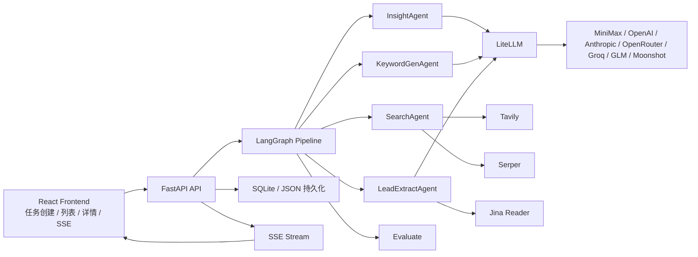
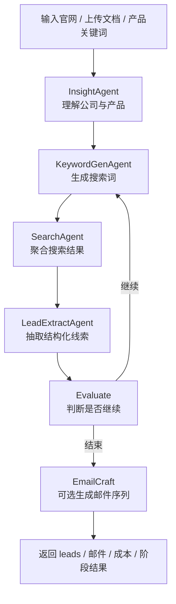

<h1 align="center">🎯 AI Hunter：外贸客户挖掘 Agent</h1>

<p align="center">
  <strong>今天的获客靠人肉搜索 🧑💻，明天的获客交给多 Agent 流水线 🤖🤖🤖<br>
  AI Hunter：给它官网、产品资料或关键词，自动完成理解、搜索、抽线索、找联系方式和开发信</strong>
</p>

<p align="center">
  <a href="#-快速开始"></a>
  <a href="#-使用场景"></a>
  <a href="#-功能特性"></a>
  <a href="LICENSE"></a>
</p>

<p align="center">
  
  
  
  
  
</p>

**一句话**：提供公司官网、产品文档或产品关键词，再指定目标市场，系统就会自动完成公司理解、关键词生成、网页搜索、线索提取和联系方式发现。&nbsp;&nbsp;[**English**](README.md)

<p align="center">
  官网：<a href="https://b2binsights.io/">b2binsights.io</a>
  · 开源仓库：<a href="https://github.com/xiongQvQ/AI_Find_Customer">xiongQvQ/AI_Find_Customer</a>
  · 视频介绍：<a href="https://www.bilibili.com/video/BV1AzwYzXEGD">Bilibili</a>
</p>

---

## 📰 News

**2026-08** 开源版已开放「客户挖掘 + 邮件草稿生成 + campaign 自动发送」主链路。

**2026-08** 有界面与无界面统一到同一套 `producer / consumer` 队列，不再是两套分裂逻辑。

**2026-08** 提供基于 **Hermes + Skill** 的可定制化客户挖掘方案，适合需要更灵活策略的团队。

---

## ✨ 核心场景

<table align="center" width="100%">
<tr>
<td width="25%" align="center" style="vertical-align: top; padding: 15px;">

<h3>🌍 外贸获客</h3>

<div align="center">
  
</div>

<p align="center"><strong>官网 → 线索</strong></p>

<p align="center">给一个工厂官网或产品关键词，自动找海外经销商、批发商、进口商</p>

</td>
<td width="25%" align="center" style="vertical-align: top; padding: 15px;">

<h3>✉️ 开发信序列</h3>

<div align="center">
  
</div>

<p align="center"><strong>草稿 → 审核 → 发送</strong></p>

<p align="center">基于 ICP 与官网洞察生成 3 步英文开发信，人工批准后再进入 campaign</p>

</td>
<td width="25%" align="center" style="vertical-align: top; padding: 15px;">

<h3>🖥️ 无界面自动化</h3>

<div align="center">
  
</div>

<p align="center"><strong>7x24 持续挖掘</strong></p>

<p align="center">Producer 入队、Consumer 执行、Scheduler 发信，飞书推送进度与告警</p>

</td>
<td width="25%" align="center" style="vertical-align: top; padding: 15px;">

<h3>🧩 Hermes + Skill</h3>

<div align="center">
  
</div>

<p align="center"><strong>策略可插拔</strong></p>

<p align="center">Hermes 负责判断与查询生成，Skill 封装搜索、抓取、评分，按需组合而非固定流水线</p>

</td>
</tr>
</table>

---

## 🤔 为什么需要 AI Hunter？

外贸获客并不难在「会搜索」，而难在**把搜索变成可重复的流水线**：理解产品、生成关键词、翻页抓取、抽联系人、写开发信、跟进回复。这些步骤今天仍然大量靠人肉复制粘贴。

**如果 Agent 能自己把这条链路跑完呢？**

AI Hunter 用 **多 Agent 流水线** 把获客拆成专职角色。你只需要提供：

- 🚀 **输入** —— 官网 URL、产品文档，或几条关键词
- 🎯 **市场** —— 目标客户画像与目标地区
- ⚙️ **边界** —— 目标线索数、最大轮数、每轮最少新增线索阈值

系统负责剩下的一切：理解公司、扩搜索词、多通道检索、结构化抽线索、可选生成开发信，并在达到你设定的停止条件后收敛。

---

## 🎯 流水线的优势

<table>
<tr>
<td width="33%" valign="top">

### 🤖 Agent 分工明确
`Insight → KeywordGen → Search → LeadExtract → Evaluate`。推理模型负责 ReAct 决策，普通模型负责抽取、生成与改写。

```text
InsightAgent     理解公司与产品
KeywordGenAgent  生成搜索词
SearchAgent      聚合多通道结果
LeadExtractAgent 抽取结构化线索
Evaluate         判断是否继续
```

</td>
<td width="33%" valign="top">

### 🔎 多通道搜索
Google Search、Google Maps、B2B 平台站内搜索，再按 URL 类型自适应抓取。

```text
Tavily   通用网页搜索（支持多 Key 轮询）
Serper   Google / Google Maps
Jina     官网与内容页正文读取
```

</td>
<td width="33%" valign="top">

### 👀 你负责审核
前端看队列和 Hunt 详情；邮件必须人工批准后才能进入 campaign。你只在需要时介入。

```bash
# 前端
http://localhost:3000

# API / Swagger
http://127.0.0.1:8000/docs
```

</td>
</tr>
</table>

| | AI Hunter | 手工获客 / 普通爬虫 |
|---|---------|-----------------|
| 🎯 **输入** | 官网、文档或关键词即可启动 | 人工想词、人工翻页 |
| ⚡ **执行** | 多 Agent 自动迭代到停止条件 | 复制粘贴上下文 |
| 📇 **产出** | 结构化线索（邮箱 / 电话 / 地址 / 社媒） | Excel 手工整理 |
| ✉️ **开发信** | 3 步序列 + 审核 + campaign 发送 | 自己写、自己发 |
| 🖥️ **部署** | 有界面 + VPS 无界面队列 | 难持续跑 |
| 🔌 **模型** | LiteLLM 接入 MiniMax / OpenAI / Anthropic 等 | 绑死单一供应商 |

---

## 🎬 使用场景

### 🌍 1. 外贸工厂找海外经销商

你告诉系统：*"这是我们微动开关工厂的官网，目标市场是美国电气经销商。"* **流水线自动完成搜索与抽取。**

```
人类输入：官网 + 产品关键词 + 目标地区

🤖 AI Hunter 的行动：
├── 📖 InsightAgent 阅读官网 / 文档，理解产品与 ICP
├── 🔑 KeywordGenAgent 生成英文搜索词与平台内查询
├── 🔎 SearchAgent 聚合：
│   ├── Google / Tavily 有机搜索
│   ├── Google Maps 本地经销商
│   └── B2B 平台列表页
├── 🧬 LeadExtractAgent 按域名去重后深度抓取
│   └── 抽出公司、邮箱、电话、地址、社媒
├── 📊 Evaluate 对照 target_lead_count / max_rounds / min_new_leads_threshold
│   ├── 未达标 → 带着新词继续下一轮
│   └── 达标 → 结束挖掘
└── ✉️ 可选 EmailCraft：生成 3 步开发信草稿，等待审核
```

### 🏗️ 2. 有界面提交，后台队列执行

前端不再把「新建任务」当成浏览器里干等的长请求，而是提交一个 `automation job`，由 consumer 领取后真正开 Hunt。

```
人类操作：新建任务页填写官网、关键词、地区、邮件样例

🤖 系统真实行为：
├── 前端创建一个 automation job
├── TemplateSeedWorker 先预热 template_seed
├── AutomationConsumer 领取 job，创建真实 hunt
├── Hunt 跑完搜索 / 抽取 / 评估 / 邮件生成
├── 完成后自动创建 campaign，交给 EmailScheduler
└── Dashboard 展示：队列状态、最近发现企业、最近发送、最近回复
```

### 💰 3. VPS 上 7x24 无界面外呼

适合「模板准备 → 挖掘 → 生成邮件 → 自动发送」长期运行。单个 Hunt 有边界，队列系统持续入队。

```bash
# 一条命令持续往队列里塞任务：
python scripts/hunt_queue.py producer \
  --payload-file ./automation_job.json \
  --continuous \
  --enqueue-interval-seconds 60 \
  --max-pending-jobs 3
```

```
🤖 自动发生的事情：
├── 📊 Producer 把 payload 写入 SQLite hunt_jobs
├── 🌱 TemplateSeedWorker 为 queued job 预热模板种子
├── 🏃 AutomationConsumer 领取并执行 hunt
├── 📬 完成后把可发送序列写入 email_messages
├── ⏰ EmailScheduler 每 60 秒扫描 pending 并发送
└── 📥 EmailReply 按间隔扫描 IMAP，命中后停掉后续跟进
```

---

## 📦 开源仓库范围

这次公开的开源仓库只保留：

- `backend/`：FastAPI + LangGraph 主服务
- `frontend/`：React + Vite 前端
- 必要的配置示例和文档

以下模块不进入公开仓库：

- `license-server/`
- `license-server-v2/`
- `landing/`

### 当前版本边界

- 邮件自动发送建议通过 `campaign / scheduler` 链路使用，不建议把详情页当成完整营销自动化系统
- 邮件发送依赖你自己配置 SMTP / IMAP、授权码与安全策略，仓库不会提供任何第三方邮箱账号
- 非本机访问 API 时，如果没有配置 `API_ACCESS_TOKEN`，接口默认只允许 localhost 访问

---

## 🚀 快速开始

### ✅ 开始前先确认

- Python `3.11+`
- Node.js `18+` 或 Bun
- 至少一个 LLM API Key
- 至少一个搜索 API Key

### 1. 克隆仓库

```bash
git clone https://github.com/xiongQvQ/AI_Find_Customer.git
cd AI_Find_Customer
```

### 2. 启动后端

```bash
cd backend
python3 -m venv .venv
source .venv/bin/activate
pip install --upgrade pip
pip install -r requirements.txt
cp .env.example .env
uvicorn api.app:app --host 127.0.0.1 --port 8000
```

后端默认地址：

- API：`http://127.0.0.1:8000`
- Swagger：`http://127.0.0.1:8000/docs`

### 3. 启动前端

```bash
cd frontend
bun install
bun run dev
```

前端默认地址：`http://localhost:3000`

### 🔌 最小可运行配置

把密钥写进 `backend/.env`，不要写进前端代码：

```env
LLM_MODEL=minimax/MiniMax-M2.1-highspeed
REASONING_MODEL=minimax/MiniMax-M2.5
MINIMAX_API_KEY=your-minimax-key
MINIMAX_API_BASE=https://api.minimax.io/v1

SERPER_API_KEY=your-serper-key
TAVILY_API_KEY=tvly-key-1,tvly-key-2
JINA_API_KEY=your-jina-key
```

推荐优先使用 **MiniMax**。`MINIMAX_API_BASE`：

- 国际站默认：`https://api.minimax.io/v1`
- 中国大陆可选：`https://api.minimaxi.com/v1`

---

## ✨ 功能特性

<table>
<tr>
<td width="50%" valign="top">

### 🤖 多 Agent 流水线
- `Insight -> KeywordGen -> Search -> LeadExtract -> Evaluate`
- 双模型协作：推理模型做 ReAct，普通模型做抽取与改写
- 继续挖掘参数可控：目标线索数、最大轮数、每轮最少新增阈值

### 📥 灵活输入
- 官网 URL、产品关键词、目标客户画像、目标地区
- 上传 PDF / Excel / CSV / Word / Markdown / TXT / JSON
- 默认单文件上限 `50 MB`

### 🔎 搜索与抓取
- Google Search、Google Maps、B2B 平台站内搜索
- 针对官网、列表页、内容页自适应抓取
- `lead_extract` 先按官网域名去重，再做深度抓取

</td>
<td width="50%" valign="top">

### ✉️ 邮件链路
- 基于 ICP 与历史样例生成 3 步开发信序列
- 详情页预览、批准、拦截、手动发送、回信检测
- 已批准序列创建为 campaign，由 scheduler 持久化发送

### 📡 实时与可观测
- FastAPI + SSE 推送任务进展
- 接入 Langfuse 后可记录 LLM 成本、Token 与延迟
- 无界面模式支持飞书事件、汇总与告警

### 🔌 可替换模型
- 统一通过 LiteLLM 接入 OpenAI、Anthropic、OpenRouter、Groq、GLM、Moonshot、MiniMax
- 邮件链路可单独配置模型、RPM 与 API Key，避免和主流程抢额度

</td>
</tr>
</table>

---

## 🏗️ 架构图



## 🔁 工作流



当前停止逻辑由以下参数控制：

- `target_lead_count`：目标线索总数
- `max_rounds`：最多迭代轮数
- `min_new_leads_threshold`：单轮最少新增线索数

这个版本已经修正了「目标线索数设为 200 时，系统因隐藏动态阈值而过早停止」的问题。现在会按你显式配置的 `min_new_leads_threshold` 来判断是否继续。

---

## 🖥️ 有界面模式

前端已经对齐到 producer / consumer 思路，不再把「新建任务」当成一个浏览器里直接等待完成的长请求。

当前有界面模式的真实行为是：

1. 在 `新建任务` 页面填写官网、关键词、地区、模板样例等信息
2. 点击提交后，前端会创建一个 `automation job`
3. `consumer` 领取这个 job 时，会先准备 `template_seed`
4. 然后再创建真实 hunt，执行搜索、抽取、评估、邮件生成
5. hunt 完成后自动创建 campaign，并交给 `EmailScheduler` 消费发送
6. 首页和详情页优先展示 `job` 队列状态，只有在真实 hunt 已创建后，才继续下钻到 hunt 详情

这意味着：

- 前端负责 `提交任务 + 查看队列 + 查看 Hunt / Campaign 状态`
- 后端负责 `真正执行 producer / consumer + scheduler`
- 有界面和无界面现在走的是同一套底层任务系统
- 队列任务详情页会展示 `job 状态 / 尝试次数 / 目标线索数 / 当前线索数 / Hunt 阶段 / 最近错误`
- Dashboard 还会展示 `运营摘要卡 + 最近发现企业 / 最近发送邮件 / 最近回复` 事件流
- 继续挖掘不再直接调用旧的同步 resume，而是基于当前 hunt 创建新的后续 queue job

---

## ✉️ 邮件能力

当前版本的邮件链路分成 3 层：

1. 可以先基于官网洞察与历史模板样例预生成一版 `template seed`
2. 线索挖掘完成后，可选开启 `AI 邮件生成`
3. 在任务详情页中预览、审核、手动发送、手动查回信
4. 把已批准的邮件序列创建为 `campaign`，再进入自动发送 / 自动回信检测

### 邮件生成

- 新建任务或继续挖掘时可以开启 `AI 邮件生成`
- 也可以先调用 `POST /api/v1/email-template-seeds/prepare` 预生成模板种子，再把 `template_seed` 带进 hunt
- 可以不提供模板，系统会自动生成模板策略和 3 步英文开发信
- 也可以提供历史邮件样例与备注，系统会先提取你的风格再生成
- 如果请求里已经带了 `template_seed`，邮件生成会优先复用这份种子，只对具体 lead 做轻量个性化，而不是每次从零起草模板策略
- 生成结果会包含：
  - `template_seed`
  - `template_profile`
  - `template_plan`
  - `validation_summary`
  - `review_summary`

### 邮件预览与审核

任务详情页支持预览每一组邮件序列，可查看主题、正文、模板来源、生成模式、验证状态、review 问题、模板表现。可人工：

- 批准草稿
- 拦截草稿
- 手动发送单封邮件
- 手动检查回信

### 自动发送与 campaign

自动发送不再依赖任务详情页里的临时内存队列。正确做法是：

1. 先完成邮件生成
2. 只把已批准 / 可发送的序列创建为 `campaign`
3. 启动 campaign
4. 由后端 scheduler 持久化发送

### SMTP / IMAP 与授权码

邮件发送前，需要在前端 `Settings` 页面或 `backend/.env` 中配置邮箱参数。

如果你希望直接在浏览器里保存这些配置，需要先开启：

```env
SETTINGS_API_ENABLED=true
```

最少需要准备：

- `EMAIL_FROM_ADDRESS`
- `EMAIL_SMTP_HOST`
- `EMAIL_SMTP_PORT`
- `EMAIL_SMTP_USERNAME`
- `EMAIL_SMTP_PASSWORD`

如果要自动检测回信，还需要：

- `EMAIL_IMAP_HOST`
- `EMAIL_IMAP_PORT`
- `EMAIL_IMAP_USERNAME`
- `EMAIL_IMAP_PASSWORD`

注意：

- 很多邮箱服务商不允许直接使用登录密码，而是需要在邮箱后台开启 `IMAP / SMTP`
- 通常还要生成 `应用密码`、`客户端授权码` 或 `第三方客户端授权码`
- 必须先在 `Settings` 页面测试 SMTP / IMAP 连接成功，系统才允许开启自动发送和自动回信检测
- 当前设置页已内置常见国内邮箱服务商模板，包括：
  - QQ 邮箱
  - 腾讯企业邮箱
  - 网易 163 / 126
  - 网易企业邮箱
  - 阿里云企业邮箱
  - 手动填写

---

## 📁 项目结构

```text
AI_Find_Customer/
├── backend/                # FastAPI + LangGraph 主服务
│   ├── agents/             # 各类 Agent
│   ├── api/                # 路由、SSE、持久化接口
│   ├── config/             # 配置读取
│   ├── graph/              # StateGraph 与流程控制
│   ├── tools/              # 搜索、抓取、LLM、解析工具
│   ├── observability/      # Langfuse 等观测能力
│   └── tests/              # pytest 测试
├── frontend/               # React 前端
├── deploy/systemd/         # API / producer / worker 的 systemd 示例
├── README.md
├── README_CN.md
└── .gitignore
```

---

## ⚙️ 配置文件放哪里

所有运行时密钥与邮件参数都放在 `backend/.env`，也可以通过前端 `Settings` 页面保存。

正确做法：

1. 复制 `backend/.env.example` 为 `backend/.env`
2. 在 `backend/.env` 内填写模型、搜索、邮件相关配置
3. 不要把密钥写进前端代码
4. 如果要使用前端 `Settings` 页面在线保存，请在 `.env` 中额外设置 `SETTINGS_API_ENABLED=true`
5. 前端 `Settings` 页面保存的内容会写回后端 `.env`

常见邮件相关变量示例：

```env
EMAIL_FROM_NAME=Your Company
EMAIL_FROM_ADDRESS=sales@example.com
EMAIL_REPLY_TO=sales@example.com
EMAIL_SMTP_HOST=smtp.exmail.qq.com
EMAIL_SMTP_PORT=465
EMAIL_SMTP_USERNAME=sales@example.com
EMAIL_SMTP_PASSWORD=your-app-password
EMAIL_IMAP_HOST=imap.exmail.qq.com
EMAIL_IMAP_PORT=993
EMAIL_IMAP_USERNAME=sales@example.com
EMAIL_IMAP_PASSWORD=your-app-password
EMAIL_USE_TLS=true
EMAIL_AUTO_SEND_ENABLED=false
EMAIL_REPLY_DETECTION_ENABLED=false
EMAIL_LLM_MODEL=minimax/MiniMax-M2.1-highspeed
EMAIL_REASONING_MODEL=minimax/MiniMax-M2.5
EMAIL_LLM_REQUESTS_PER_MINUTE=60
EMAIL_REASONING_REQUESTS_PER_MINUTE=30
EMAIL_REQUIRE_APPROVAL_BEFORE_SEND=true
EMAIL_OPENAI_API_KEY=
EMAIL_ANTHROPIC_API_KEY=
EMAIL_OPENROUTER_API_KEY=
EMAIL_GROQ_API_KEY=
EMAIL_ZAI_API_KEY=
EMAIL_MOONSHOT_API_KEY=
EMAIL_MINIMAX_API_KEY=
```

如果你担心 MiniMax 的 RPM 被搜索主链路和邮件链路一起打满，建议单独配置：

- `EMAIL_LLM_MODEL`
- `EMAIL_REASONING_MODEL`
- `EMAIL_LLM_REQUESTS_PER_MINUTE`
- `EMAIL_REASONING_REQUESTS_PER_MINUTE`

这样邮件生成、自动修复、邮件 ReAct 会走单独模型和单独限速，不会和主流程抢同一个默认模型额度。

如果你希望邮件链路连 API Key 都彻底独立，还可以额外配置 `EMAIL_OPENAI_API_KEY`、`EMAIL_ANTHROPIC_API_KEY`、`EMAIL_OPENROUTER_API_KEY`、`EMAIL_GROQ_API_KEY`、`EMAIL_ZAI_API_KEY`、`EMAIL_MOONSHOT_API_KEY`、`EMAIL_MINIMAX_API_KEY`。设置后，邮件链路会优先使用这些专用 Key；留空时才回退到主链路的 Key。

邮件发送与模板轮换的当前行为：

- 如果没有配置 `EMAIL_*` 专用模型、RPM、API Key，邮件链路会自动回退到主链路配置
- campaign 入队时会把同一企业下发现的多个唯一企业邮箱都展开成独立发送序列，而不是只保留一个 `target_email`
- 真正的频控仍由 `EmailScheduler` 统一执行，受 `EMAIL_DAILY_SEND_LIMIT` 和 `EMAIL_HOURLY_SEND_LIMIT` 约束
- 同一模板分组默认每发送满 `100` 个收件目标就自动起下一版模板种子，避免一套文案长时间不变

如果你要长期跑无界面自动外呼，也可以把邮件链路拆到另一套模型，例如主链路继续跑 MiniMax，邮件生成走 OpenRouter：

```env
LLM_MODEL=minimax/MiniMax-M2.1-highspeed
REASONING_MODEL=minimax/MiniMax-M2.5
EMAIL_LLM_MODEL=openrouter/google/gemini-flash-1.5
EMAIL_REASONING_MODEL=openrouter/deepseek/deepseek-r1
```

---

## 🖥️ 无界面部署到 VPS

如果你不需要前端界面，只想在 VPS 上持续执行「模板准备 -> 挖掘 -> 生成邮件 -> 自动发送」，现在有两种模式：

- 简单模式：`headless_worker.py`  
  适合单机串行跑，一轮 hunt 完成后再开始下一轮
- 队列模式：`hunt_queue.py producer` + `api.app` 内嵌 consumer  
  适合当前默认的生产者-消费者结构

如果你要真正的生产者-消费者，当前推荐拆成两个常驻进程：

- `API 服务`：负责 hunt、内嵌 consumer、template seed prewarm、campaign API、发送 scheduler、回信检测
- `Producer 服务`：持续往 `hunt_jobs` 队列写入新的挖掘任务

这套结构本质上就是两层生产者-消费者：

- 第一层生产者：`backend/scripts/hunt_queue.py producer`
- 第一层消费者：`api.app` 内嵌 `AutomationConsumer`
- 模板预热：`api.app` 内嵌 `TemplateSeedWorker`
- 第二层消费者：`api.app` 内置的 `EmailScheduler`

当前真实逻辑再具体一点：

1. `hunt_queue.py producer` 把 hunt payload 持久化写入 SQLite 的 `hunt_jobs`
2. `TemplateSeedWorker` 先为 `queued` job 预热 `template_seed`
3. `AutomationConsumer` 领取 job，直接在进程内创建真实 hunt
4. consumer 轮询这个 hunt，直到状态变成 `completed`
5. hunt 完成后，如果开启了邮件生成，consumer 会自动创建并启动 campaign
6. campaign 创建时，会把可发送的邮件序列写进 SQLite：`lead_email_sequences`、`email_messages`
7. `EmailScheduler` 后台循环每 60 秒扫描一次 `email_messages` 里的 `pending` 记录
8. 到时间的邮件会被发送，发送后更新状态为 `sent / failed`
9. `EmailReply` 后台循环按配置间隔扫描 IMAP 回信，命中后会停掉后续跟进

几个关键实现细节：

- `lead_extract` 会先按官网域名去重，再做深度抓取，避免同一家公司被多个官网 URL 重复送进 LLM
- `template_seed` 负责把「模板策略生成」和「线索挖掘」解耦，所以 producer / consumer 不需要等整批 lead 全部完成后再决定模板方向
- `email_messages` 是真正的持久化发送队列，适合 producer / consumer 长期运行
- 如果一个 lead 抽到了多个企业邮箱，campaign 会为每个唯一邮箱建立独立 sequence 和 message 队列项
- 模板不会无限复用同一个 seed；超过模板发送上限后会自动生成新版本继续跑

也就是说，现在已经是两层持久化队列：

- 第一层队列：`hunt_jobs` —— 待执行的客户挖掘任务
- 第二层队列：`email_messages` —— 待发送的邮件消息

当前两层队列都不是 Redis / MQ，而是 SQLite 持久化队列。

### 自动任务配置

```bash
cd backend
cp automation_job.example.json automation_job.json
```

然后编辑 `automation_job.json`。如果你希望系统长期持续运行，而不是只跑一轮，推荐把单轮任务限制在「尽量挖满一批，但仍然有边界」，例如：

```json
{
  "website_url": "https://www.gdushun.com/",
  "description": "Find electrical distributors, importers and wholesalers who may buy micro switches, rotary switches and anti-dumping switches.",
  "product_keywords": ["micro switch", "rotary switch", "anti-dumping switch"],
  "target_customer_profile": "Electrical distributors, importers and wholesalers",
  "target_regions": ["United States"],
  "target_lead_count": 100,
  "max_rounds": 20,
  "min_new_leads_threshold": 1,
  "enable_email_craft": true,
  "email_template_examples": ["<your sample outreach email>"],
  "email_template_notes": "Keep the tone professional, concise, and suitable for foreign trade cold outreach."
}
```

这组参数的真实语义是：

- 单个 hunt 以 `100` 个 lead 为目标
- 最多跑 `20` 轮
- 只要单轮还能新增 `1` 个 lead，就继续
- 但整个系统通过 producer / consumer 持续入队和消费，所以整体不会停

`backend/automation_job.example.json` 已经按这组推荐值更新，可以直接复制后开始跑持续任务。

不建议把「单个 hunt」做成无限执行；更合理的是「单个 hunt 有边界，但队列系统 7x24 持续运行」。

### 启动 API

```bash
cd backend
source .venv/bin/activate
uvicorn api.app:app --host 0.0.0.0 --port 8000
```

### 启动 headless worker

这是兼容保留的串行模式。它仍然可用，但不是当前推荐的长期运行方式。

```bash
cd backend
source .venv/bin/activate
python scripts/headless_worker.py \
  --payload-file ./automation_job.json \
  --continuous \
  --auto-start-campaign \
  --cycle-interval-seconds 60 \
  --status-poll-seconds 15
```

上面这条命令的语义是：每轮如果开启邮件生成，会先准备一份 `template_seed`，然后再挖到 `target_lead_count`，自动生成邮件、自动建 campaign，把邮件写入持久化待发送队列，发送由后台 scheduler 按时间消费。

### 启动推荐的 queue 模式

```bash
cd backend
cp automation_job.example.json automation_job.json
source .venv/bin/activate
python scripts/hunt_queue.py producer \
  --payload-file ./automation_job.json \
  --continuous \
  --enqueue-interval-seconds 60 \
  --max-pending-jobs 3
```

这条命令表示：每 60 秒检查一次；如果 `hunt_jobs` 里排队中和执行中的任务少于 3 个，就继续入队。

默认情况下，不需要再单独启动 consumer。`api.app` 已内嵌：

- `AutomationConsumer`
- `TemplateSeedWorker`
- `EmailScheduler`
- `EmailReply`

只有当你明确关闭：

```env
AUTOMATION_EMBEDDED_CONSUMER_ENABLED=false
```

时，才需要单独启动 consumer：

```bash
cd backend
source .venv/bin/activate
python scripts/hunt_queue.py consumer \
  --continuous \
  --poll-seconds 15 \
  --retry-delay-seconds 120 \
  --status-poll-seconds 15
```

如果你要更强的挖掘吞吐，可以显式关闭 embedded consumer 后，再起多个独立 consumer 进程；否则不要让它和内嵌 consumer 并跑。

### 状态监控与飞书通知

无界面模式下，建议把监控拆成三层：实时状态接口、周期汇总、异常告警。

当前版本已经提供这些接口：

```bash
GET /api/v1/automation/status
GET /api/v1/automation/metrics?hours=24
GET /api/v1/automation/health
```

它们会返回：`hunt_jobs` 队列积压、当前运行中的 hunt 数、`email_messages` 待发送 / 已发送 / 失败数量、最近窗口新增企业数、生成邮件序列数、发送成功 / 失败 / 回复数、最近失败示例。

如果你想接飞书机器人，新增这些配置：

```env
AUTOMATION_FEISHU_WEBHOOK_URL=https://open.feishu.cn/open-apis/bot/v2/hook/xxx
AUTOMATION_EVENT_NOTIFICATIONS_ENABLED=true
AUTOMATION_DISCOVERY_BATCH_SIZE=5
AUTOMATION_SEND_BATCH_SIZE=10
AUTOMATION_EVENT_FLUSH_INTERVAL_SECONDS=600
AUTOMATION_SUMMARY_ENABLED=true
AUTOMATION_SUMMARY_INTERVAL_SECONDS=7200
AUTOMATION_ALERTS_ENABLED=true
AUTOMATION_ALERT_INTERVAL_SECONDS=1800
AUTOMATION_ALERT_BACKLOG_THRESHOLD=20
AUTOMATION_ALERT_FAILED_MESSAGES_THRESHOLD=10
```

含义：

- `AUTOMATION_EVENT_NOTIFICATIONS_ENABLED=true`：开启正常业务事件通知
- `AUTOMATION_DISCOVERY_BATCH_SIZE=5`：默认每累计 5 家新企业推送一条飞书消息
- `AUTOMATION_SEND_BATCH_SIZE=10`：默认每累计 10 封已发送邮件推送一条飞书消息
- `AUTOMATION_EVENT_FLUSH_INTERVAL_SECONDS=600`：如果批量阈值一直没凑满，最多每 10 分钟也会冲刷一次事件通知
- `AUTOMATION_SUMMARY_ENABLED=true`：每隔一段时间推一次汇总
- `AUTOMATION_SUMMARY_INTERVAL_SECONDS=7200`：默认 2 小时推一次
- `AUTOMATION_ALERTS_ENABLED=true`：开启基础告警
- `AUTOMATION_ALERT_BACKLOG_THRESHOLD=20`：当 hunt 队列或邮件待发积压超过 20 时告警
- `AUTOMATION_ALERT_FAILED_MESSAGES_THRESHOLD=10`：当最近窗口失败邮件数超过 10 时告警

当前飞书通知分成 4 类：

- `任务失败`：立即推送；包括创建 hunt 失败、hunt 执行失败、consumer 重试前失败
- `新增企业`：按批推送；默认累计 5 家推一次
- `邮件已发送`：按批推送；默认累计 10 封推一次
- `周期汇总`：定时推送整体运行情况

周期汇总消息会包含 Hunt 已创建 / 成功完成 / Hunt 失败数量、队列重试中 / 当前排队 / 当前运行 / 队列永久失败数量、新增企业数与生成邮件序列数、当前运行中的官网与阶段进度、最近失败 Hunt 的网站、阶段、错误、是否在重试、最近完成的网站、抓到的企业数、生成的邮件序列数、待发送 / 已发送 / 失败 / 回复数、「为什么没发邮件」的直接解释、失败原因 Top 与最近失败示例。

测试阶段如果你想更快看到飞书消息，可以把这几个值调小：

```env
AUTOMATION_DISCOVERY_BATCH_SIZE=1
AUTOMATION_SEND_BATCH_SIZE=1
AUTOMATION_EVENT_FLUSH_INTERVAL_SECONDS=60
AUTOMATION_SUMMARY_ENABLED=false
AUTOMATION_ALERTS_ENABLED=false
```

如果你想跳过人工审核，直接放行 `needs_review` 的邮件序列，可以在 `.env` 中设置：

```env
EMAIL_REQUIRE_APPROVAL_BEFORE_SEND=false
```

### systemd 常驻

仓库已经提供 systemd 示例文件：

- [`deploy/systemd/ai-hunter-api.service`](deploy/systemd/ai-hunter-api.service)
- [`deploy/systemd/ai-hunter-producer.service`](deploy/systemd/ai-hunter-producer.service)
- [`deploy/systemd/ai-hunter-worker.service`](deploy/systemd/ai-hunter-worker.service)

推荐：

- `ai-hunter-api.service`
- `ai-hunter-producer.service`

`ai-hunter-worker.service` 是兼容保留的串行 worker 示例，不建议和 embedded consumer 一起长期并跑。

把里面的 `/opt/ai-hunter/backend` 改成你 VPS 的实际路径后：

```bash
sudo cp deploy/systemd/ai-hunter-api.service /etc/systemd/system/
sudo cp deploy/systemd/ai-hunter-producer.service /etc/systemd/system/
sudo systemctl daemon-reload
sudo systemctl enable --now ai-hunter-api
sudo systemctl enable --now ai-hunter-producer
```

### 无界面模式测试

本仓库已经补了针对无界面链路的测试。你可以直接执行：

```bash
pytest backend/tests/test_automation/test_job_queue.py \
  backend/tests/test_automation/test_metrics.py \
  backend/tests/test_automation/test_notifier.py \
  backend/tests/test_api/test_automation_routes.py \
  backend/tests/test_scripts/test_hunt_queue.py \
  backend/tests/test_scripts/test_headless_worker.py \
  backend/tests/test_api/test_email_routes.py \
  backend/tests/test_api/test_routes.py
```

这组测试覆盖了：

- `hunt_jobs` 队列的入队、领取、完成、重试
- automation status / metrics / health 接口
- 飞书汇总与告警文案
- producer 往 hunt 队列持续入任务
- consumer 从 hunt 队列取任务并执行
- worker 创建 hunt
- 轮询 hunt 完成
- 自动创建并启动 campaign
- campaign 把邮件写入持久化发送队列
- 发送资格判断和自动发送入口

---

## 🔑 API Key 申请入口与填写方式

### 1. MiniMax

- 平台入口：https://platform.minimaxi.com/
- 官方文档：https://platform.minimaxi.com/document

建议流程：注册并登录 → 创建或查看 API Key → 填到 `backend/.env` 的 `MINIMAX_API_KEY` → 设置 `LLM_MODEL` 和 `REASONING_MODEL`。

```env
LLM_MODEL=minimax/MiniMax-M2.1-highspeed
REASONING_MODEL=minimax/MiniMax-M2.5
MINIMAX_API_KEY=your-minimax-key
MINIMAX_API_BASE=https://api.minimax.io/v1
```

### 2. Tavily

- 产品主页：https://tavily.com/
- 文档入口：https://docs.tavily.com/
- 控制台入口：https://app.tavily.com/

这个项目支持多个 Tavily Key 直接写到一个环境变量里，后端会按英文逗号拆分并轮询使用。建议至少准备 `2-3` 个 Key，中间用英文逗号连接，不要加空格：

```env
TAVILY_API_KEY=tvly-dev-xxx,tvly-prod-yyy,tvly-prod-zzz
```

### 3. Serper

- 产品主页：https://serper.dev/

`SERPER_API_KEY` 在这个项目里主要承担 Google Search 补充搜索和 Google Maps 搜索。

```env
SERPER_API_KEY=your-serper-key
```

### 4. Jina Reader

- 产品主页：https://jina.ai/
- Reader 说明：https://jina.ai/reader/

`JINA_API_KEY` 用于网页抓取与正文读取。

```env
JINA_API_KEY=your-jina-key
```

### 5. Langfuse（可选）

- 产品主页：https://langfuse.com/
- Cloud：https://cloud.langfuse.com/
- 文档：https://langfuse.com/docs

如果你想看每次 LLM 调用的 Token、成本、时延，可以开启：

```env
LANGFUSE_ENABLED=true
LANGFUSE_PUBLIC_KEY=your-public-key
LANGFUSE_SECRET_KEY=your-secret-key
LANGFUSE_HOST=https://cloud.langfuse.com
```

---

## 📋 关键配置项说明

| 变量名 | 作用 | 默认建议 |
| --- | --- | --- |
| `LLM_MODEL` | 常规抽取/生成模型 | `minimax/MiniMax-M2.1-highspeed` |
| `REASONING_MODEL` | ReAct 决策模型 | `minimax/MiniMax-M2.5` |
| `MINIMAX_API_KEY` | MiniMax 密钥 | 必填 |
| `TAVILY_API_KEY` | 通用网页搜索，支持多个 key | 建议至少 2 个 |
| `SERPER_API_KEY` | Google / Google Maps 搜索 | 建议配置 |
| `JINA_API_KEY` | 网页正文抓取 | 建议配置 |
| `DEFAULT_TARGET_LEAD_COUNT` | 默认目标线索数 | `200` |
| `DEFAULT_MAX_ROUNDS` | 默认最大轮数 | `10` |
| `MIN_NEW_LEADS_THRESHOLD` | 每轮最少新增线索阈值 | `5` |
| `API_ACCESS_TOKEN` | 非本机访问时的接口令牌 | 生产环境建议设置 |
| `SETTINGS_API_ENABLED` | 是否启用前端 Settings 在线保存 | 想用浏览器配置时设为 `true` |

### 前后端联调说明

- 前端默认通过 Vite 代理把 `/api` 转发到 `http://localhost:8000`
- 如果后端配置了 `API_ACCESS_TOKEN`，前端需要额外设置 `VITE_API_ACCESS_TOKEN`
- 未配置 `API_ACCESS_TOKEN` 时，后端只允许 localhost 访问，远程机器访问会返回 `403`

---

## 📡 常用接口

- `POST /api/v1/upload`：上传文件
- `POST /api/v1/hunts`：创建新的客户挖掘任务
- `GET /api/v1/hunts`：获取任务列表
- `GET /api/v1/hunts/{hunt_id}/status`：查看任务状态
- `GET /api/v1/hunts/{hunt_id}/result`：查看任务结果
- `GET /api/v1/hunts/{hunt_id}/cost`：查看成本统计
- `GET /api/v1/hunts/{hunt_id}/stream`：SSE 实时进度流
- `POST /api/v1/automation/jobs`：创建 queue job
- `GET /api/v1/automation/jobs`：查看 queue job 列表
- `GET /api/v1/automation/jobs/{job_id}`：查看 queue job 详情
- `POST /api/v1/automation/jobs/from-hunt/{hunt_id}`：基于已有 hunt 创建后续 queue job
- `POST /api/v1/automation/jobs/{job_id}/cancel`：取消 queue job
- `POST /api/v1/automation/jobs/{job_id}/retry`：把失败/完成的 job 重新入队
- `GET /api/v1/health`：健康检查

---

## ❓ 常见问题

### 1. 为什么我把最大返回线索数设成 200，任务却提前停了？

看三个参数：`target_lead_count`、`max_rounds`、`min_new_leads_threshold`。

当前逻辑会在以下任一条件满足时结束：

- 已达到目标线索数
- 已达到最大轮数
- 单轮新增线索数低于你配置的 `min_new_leads_threshold`

这个版本已经修正了「隐藏动态阈值导致过早停止」的问题。

### 2. 为什么前端 Settings 页面保存不了配置？

先检查 `backend/.env` 里是否开启了：

```env
SETTINGS_API_ENABLED=true
```

如果这个开关没开，前端设置页可以展示，但后端不会挂载设置保存接口。

### 3. 为什么我已经配置了 SMTP / IMAP，还是不能自动发送或自动查回信？

因为现在不是「填了参数就算可用」，还要求你在 `Settings` 页面里先测试连接成功：

- 自动发送依赖 SMTP 测试成功
- 自动回信检测依赖 IMAP 测试成功
- 只生成邮件草稿和预览，不依赖 SMTP / IMAP

---

## 🛠️ 常用开发命令

### Backend

```bash
cd backend
python -m pytest tests/ -q
python -m pytest tests/ --cov=. --cov-report=term-missing
uvicorn api.app:app --reload --port 8000
```

### Frontend

```bash
cd frontend
bun install
bun run dev
bun run build
```

---

## 🗺️ 定制化方案：Hermes + Skill

如果你需要更灵活的客户挖掘方案，我们提供基于 **Hermes + Skill** 的可定制化服务：

- **Hermes Agent** 负责判断、策略、查询生成和决策，Python 脚本负责搜索、抓取、去重等确定性操作
- **Skill 插件化**：核心能力封装为可复用的 Skill，按需组合，而非固定流水线
- **b2b-lead-hunter Skill**：多通道搜索（有机搜索、B2B 平台、Google Maps、竞品渠道、行业协会）、公司官网深度研读、联系方式提取（邮箱/电话/社媒/决策人）、证据驱动的线索评分与优先级排序、多格式导出（JSONL/CSV）
- **质量优先**：先小规模 Pilot 验证再全量执行，每条线索可溯源、有证据支撑
- **合规优先**：仅采集公开数据，不自动发送邮件，尊重隐私法规

如有定制需求，欢迎通过[官网](https://b2binsights.io/)联系我们。

---

## 📄 开源协议

本项目采用 [MIT License](LICENSE)。

---

<div align="center">

**AI Hunter** — *外贸与 B2B 客户挖掘 Agent* 🎯

<sub>Insight × Search × Extract × Email × 一个队列 × 一套流水线</sub>

</div>

<p align="center">
  <em>感谢访问 ✨ AI Hunter！</em>
</p>
