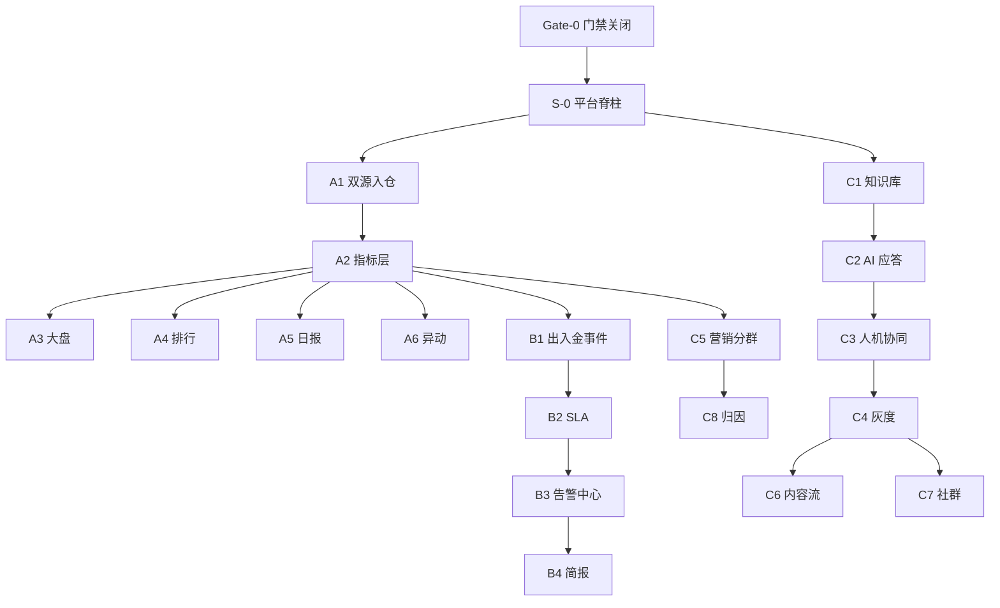

# Qube AI-Native — 可执行开发计划（PRD 重构版）

> 源文档：`docs/Qube-AI-Native-部署解决方案-PRD.md`（v1.0 草稿）  
> 本文目的：把「要什么」改写成「怎么开发」——冻结底座、切片交付、门禁推进、工具减负。  
> 原则：**先通数据、再通对内、后通对外；先规则后模型；先一条链路跑通再铺面。**

---

## 0. 一句话结论

不要按四大板块并行堆开源组件。应拆成 **1 条平台脊柱 + 3 条交付列车**：

1. **Platform Spine**：权限 / 模型网关 / 数据底座 / 事件总线  
2. **Train A · 经营可见**：MT/CRM → 指标 → 大盘 → 日报 → 异动  
3. **Train B · 运营可管**：出入金/风控节点 → SLA 告警 → 简报  
4. **Train C · 触达可服**：知识库 → AI 客服 → 人机协同 →（后）营销/社群  

每列车只交付 **端到端垂直切片**，切片验收通过后再扩面。

---

## 1. 原 PRD 的执行问题（为何要重构）

| 原计划倾向 | 风险 | 重构做法 |
|-----------|------|---------|
| 18 个 Must 同时推进 | 集成面爆炸、口径未稳就上 AI | Must 再拆成 **P0 地基 / P1 价值 / P2 增强** |
| 工具栈过重（Airbyte+CH+dbt+Superset+Grafana+夜莺+OpenObserve+n8n+Dify+RAGFlow+Chatwoot+LangBot+Mautic+PostHog…） | 运维与联调成本吞噬交付 | **MVP 冻结最小集**，其余列为候补 |
| 四板块并列 | 依赖倒置（营销归因依赖数仓，却与数仓同批） | 按依赖编序：数据 → 对内 → 对外 → 营销 |
| 开放问题未当门禁 | API/CRM/合规未清就开工会返工 | **Gate-0 不通过不开 Train A** |
| 「周数」当计划主体 | 掩盖阻塞与验收 | 以 **切片 + DoD + 门禁** 为主，周次仅作节奏参考 |

---

## 2. 北极星与开发纪律

### 2.1 北极星（开发期只盯 4 个）

1. 核心指标 **三处一致**（大盘 / 日报 / 排行）且延迟 ≤ 15 分钟  
2. 出入金超时 **100% 可预警**（先规则，后 LLM 解读）  
3. AI 客服：**可溯源 + 可转人工 + 可审计**（准确率优先于覆盖率）  
4. 所有 AI 调用 **必经网关**；敏感字段 **强制本地模型**

### 2.2 开发纪律（写进团队约定）

1. **数据先行**：无对账报告，不上看板；无指标口径签字，不上日报。  
2. **规则优先于模型**：SLA 超时、敏感词、转人工硬规则先上线；LLM 只做摘要/解读/分类增强。  
3. **垂直切片**：每个迭代必须有「从源到触达」的一条完整链路，禁止只交付半截中间件。  
4. **配置化优先**：少二开开源产品；业务逻辑放 dbt / n8n / Dify 工作流 / 策略配置。  
5. **双轨对账**：新口径与财务旧报表并行 ≥ 2 周，误差归零再切流。  
6. **AI 降级必测**：LLM 挂了，日报仍出、客服仍可留言转人工。

---

## 3. Gate-0：开工门禁（先于一切编码）

> 未关闭则 **不得进入 Train A 正式开发**（可并行做环境脚手架与 mock 数据）。

| ID | 门禁问题 | 关闭标准 | Owner |
|----|---------|---------|-------|
| G0-1 | MT4/MT5 自有还是白标？API 权限现状？ | 拿到 Manager/Web API 或确认报表导出兜底 | Qube IT |
| G0-2 | CRM 类型与只读接入方式？ | 连接串/副本/导出契约 + 样例数据 | Qube IT |
| G0-3 | 敏感字段清单与「能否出域」红线？ | 数据分级表签字（本地推理强制列表） | 合规 |
| G0-4 | 首期渠道与语种？ | 官网挂件 + 1 个 IM；中/英 | 客服+市场 |
| G0-5 | WhatsApp 等资质是否启动申请？ | 已提交申请或明确不做 | 市场 |
| G0-6 | 基础设施与预算边界？ | VPC/K8s 或等效环境可用；LLM/GPU 预算批复 | 双方 |

**Gate-0 产出物**

- 范围基线签字版（本期做 / 不做）  
- 数据接入可行性报告（含兜底路径）  
- 数据合规清单  
- 指标口径草案 v0（入金/出金/FTD/净留存/手数）  

---

## 4. MVP 工具冻结（减负后的最小集）

### 4.1 第一期只装这些

| 层 | 冻结选型 | 说明 |
|----|---------|------|
| 数据接入 | **自研 MT 适配器** + **Airbyte（或直连 CDC）** | CRM 用 Airbyte；MT 必须自研 |
| 仓库 | **PostgreSQL（业务）+ ClickHouse（分析）+ Redis** | 先单节点，预留分片 |
| 指标 | **dbt** | 口径唯一真相源 |
| BI | **Apache Superset** | 大盘 + RLS；积木报表/Metabase 后置 |
| 编排告警 | **n8n + Grafana** | 夜莺/OpenObserve 第二期再加 |
| AI 编排 | **Dify** | 客服 + 日报解读 + 内容流共用 |
| 知识库 | **RAGFlow**（或 FastGPT，二选一冻结） | 选定后不换 |
| 客服台 | **Chatwoot** | 全渠道收件箱 |
| 模型网关 | **LiteLLM** | 成本、路由、敏感任务本地强制 |
| SSO | **Keycloak 或企业现有 IdP** | 上线前置 |
| 本地模型 | **vLLM/Ollama + Qwen/DeepSeek** | 敏感任务；可先用强脱敏+商用兜底，但策略写死 |

### 4.2 明确后置（有切片再引）

| 工具 | 引入时机 |
|------|---------|
| Nightingale / OpenObserve | Train B 事件量上来后 |
| LangBot / Evolution API | Train C 社群切片 |
| Mautic / PostHog | Train C 营销切片 |
| Ahrefs/SEMrush API | SEO 切片且预算批准后 |
| JimuReport | 业务自助报表需求明确后 |

---

## 5. 架构怎么落地（开发视角）

```
源系统(MT/CRM/工单/会话)
        │
        ▼
  Ingest / Adapter  ──►  Raw Zone (PG/对象存储)
        │
        ▼
     dbt / 清洗  ──►  ClickHouse 指标层（唯一口径）
        │
        ├────────────► Superset（大盘/排行）
        ├────────────► n8n（日报、SLA、告警）
        └────────────► 营销归因（后）

事件流(出入金节点/风控) ──► n8n/Grafana ──► IM/邮件

知识库文档 ──► RAGFlow ──► Dify Agent ──► Chatwoot ──► 客户渠道
                              │
                         LiteLLM 网关
                     （商用 / 本地路由）
```

**对内/对外隔离**：外部客户只碰 DMZ 上的 Chatwoot/Bot/站点；永不直连 Superset/数仓。

---

## 6. 交付列车与垂直切片

### 6.1 Platform Spine（与 Train A 并行奠基）

| 切片 | 内容 | DoD |
|------|------|-----|
| S-0.1 环境 | VPC/K8s、PG/CH/Redis、备份、基础监控 | 一键部署文档可复现 |
| S-0.2 SSO/RBAC | 三域隔离骨架、角色：管理/销售/运营/客服/市场/运维 | 越权用例测试通过 |
| S-0.3 模型网关 | LiteLLM 接入、成本记账、敏感路由策略 | 任意调用可按板块拆成本；敏感任务拦外网 |

### 6.2 Train A · 经营可见（对应 PRD 板块一，P0）

| 切片 | 功能映射 | DoD（摘自验收，执行版） |
|------|---------|------------------------|
| A1 双源入仓 | F-001/002 | 日批对账误差=0；失败重试+告警；脏数据隔离区 |
| A2 指标层 | F-003 | 入金/出金/FTD/净留存/手数口径文档签字；三处一致测试 |
| A3 管理大盘 | F-004 | P95≤3s；RLS；显示数据截至时间 |
| A4 销售排行 | F-007 | 日更；空态/转岗规则明确 |
| A5 自动日报 | F-005 | 定时送达；LLM 挂则纯数据降级 |
| A6 异动预警 | F-006 | 阈值先上；5 分钟内推送；防轰炸升级策略 |

**Train A 完成定义（≈ v1.0）**  
管理层连续 2 周用自动日报替代手工表；延迟 ≤ 15 分钟；口径三处一致。

### 6.3 Train B · 运营可管（对应 PRD 板块二）

| 切片 | 功能映射 | DoD |
|------|---------|-----|
| B1 出入金事件 | F-011 子集 | 单据节点+停留时长可视 |
| B2 SLA 超时预警 | F-012 | 超时必告；完成不告；大额加急 |
| B3 告警中心 | F-013 | 去重聚合、分级、误报闭环 |
| B4 AI 简报 | F-015 | 有异常出摘要；无异常推「无异常」 |

**Train B 完成定义（≈ v1.1 运营半边）**  
出入金超时预警覆盖率 100%；晨会可用简报。

### 6.4 Train C · 触达可服（对应 PRD 板块三，再四）

| 切片 | 功能映射 | DoD |
|------|---------|-----|
| C1 知识库 | F-019 | 引用可溯源；版本更新旧版失效 |
| C2 AI 应答 | F-018 | 首 token≤3s；低置信不编造 |
| C3 人机协同 | F-017/020 | 转人工带上下文；离线建单+预期时间 |
| C4 灰度放量 | — | 内测 1 周 → 10% → 全量；独立解决率爬坡 |
| C5 营销分群 | F-029 | 3 条旅程；退订即时生效 |
| C6 内容流水线 | F-025/026 | AI 初稿+合规闸；违禁拦截 |
| C7 社群 | F-021/022/023 | 先标记+人工复核 4 周再自动处置 |
| C8 归因 | F-030 | 渠道→注册→FTD 与经营口径一致 |

**Train C 完成定义（≈ v1.1 客服 + v1.2 营销）**  
AI 首响 ≤ 10s；初期独立解决率 ≥ 50%（目标爬到 60%）；营销触达可归因。

---

## 7. 推荐开发顺序（依赖编序，非「四周同时开火」）



**并行策略（人力允许时）**

- Spine ∥ Gate-0 收尾、mock 数据管道  
- A1–A6 为主干；B1 在 A1 有出入金事件后启动  
- C1 可在 A 中段启动（不依赖完整大盘，但依赖网关 S-0.3）  
- C5+ 必须等 A2 客户主数据稳定  

**刻意后置（原 Could / 部分 Should）**

- Text-to-SQL（F-010）、瓶颈分析深挖（F-016）、GEO（F-028）、A/B（F-031）  
- Office Ranking（F-008）可用导出过渡  
- 多语言东南亚语种（F-034）在中英稳定后  

---

## 8. 迭代作战方式（团队怎么干活）

### 8.1 角色与所有权

| 角色 | 人数建议 | 所有权 |
|------|---------|--------|
| PM/产品 | 1 | 门禁、口径签字、切片优先级、验收 |
| 数据工程 | 2 | 适配器、Airbyte、dbt、对账 |
| 后端 | 1–2 | MT 适配器、事件接入、告警 API |
| AI 应用 | 2 | Dify/RAG、提示词与评测集、网关策略 |
| 前端 | 1 | 门户嵌入、大盘定制、客服台配置协同 |
| SRE | 1 | K8s、备份、压测、发布 |
| Qube 对接 | 每业务线 1 | 样例数据、UAT、SOP |

### 8.2 双周节奏（建议）

| 日 | 动作 |
|----|------|
| Day 1 | 切片目标冻结；依赖与风险过会 |
| Day 2–8 | 开发 + 对账/评测集建设 |
| Day 9 | 联调 + 降级演练 |
| Day 10 | Demo + 验收勾选 AC；未过则缩切片不扩面 |

### 8.3 每个切片强制三件套

1. **技术设计一页纸**：输入/输出、失败模式、降级、审计点  
2. **验收用例**：直接复用 PRD Given-When-Then（Must ≥3）  
3. **运行手册**：谁值班、告警怎么升、如何回滚  

### 8.4 AI 功能额外要求（金融场景）

- 建立 **黄金问题集**（开户/出入金/规则 ≥ 100 条）再放量  
- 指标：引用率、拒答率、转人工率、幻觉抽检合格率  
- 敏感话题硬拦截表与提示词分离配置，变更走评审  

---

## 9. 与原版本规划的映射

| 原 Phase | 重构对应 | 关键交付 |
|---------|---------|---------|
| Phase 0（奠基） | Gate-0 + S-0 | 环境、合规、连通性 |
| Phase 1 → v1.0 | Train A 完成 | 数据+大盘+日报+预警+权限网关 |
| Phase 2 → v1.1 | Train B + Train C 至 C4 | 运营监控 + 智能客服灰度 |
| Phase 3–4 → v1.2 | C5–C8 + Should 收尾 | 营销/社群/归因/打磨 |

原「第 N 周」保留为 **管理层沟通用的节奏参考**；工程排期以切片 DoD 与门禁为准。阻塞（如 MT API）触发 **报表导出兜底**，不阻塞整列车停摆——降级为 T+1 先通口径。

---

## 10. 风险 → 开发对策（执行版）

| 风险 | 开发对策 |
|------|---------|
| MT API 审批慢 | A1 双路径：API 优先 / 报表导出并行；接口抽象一层 |
| 口径打架 | dbt 为唯一真相；财务双轨 2 周；变更 RFC |
| AI 答错 | RAG 强制引用；低置信转人工；敏感硬规则；审计抽检 |
| LLM 成本 | 网关按任务路由；日报/分类用小模型；预算周审 |
| 开源组件过多 | 遵守 §4 冻结表；引入新组件需「替代什么」说明 |
| 渠道封号 | 官方资质、频控、多通道；营销与客服通道隔离 |
| 社群误杀 | 先标记+人工 4 周；再自动处置 |

---

## 11. 第一个可开发 Backlog（建议立刻开的票）

**Epic 0 — Gate & Spine**

1. 冻结指标口径 v0 并找财务确认  
2. 搭建 PG/CH/Redis + LiteLLM + SSO 骨架  
3. 定义敏感字段表与网关路由策略  

**Epic A — 经营可见**

4. MT 适配器接口设计（账户/出入金/成交）+ mock  
5. CRM CDC → 客户主数据  
6. dbt：`fact_deposit` / `fact_withdrawal` / `fact_trade` / `mart_kpi_daily`  
7. Superset：管理层大盘 + 销售 RLS  
8. n8n：日报任务 + 降级分支  
9. Grafana：核心 KPI 阈值告警  

**Epic B/C — 在 A2 稳定后拆票**

10. 出入金 SLA 状态机与超时任务  
11. RAGFlow 知识库首批文档入库 + 黄金问题集  
12. Chatwoot ↔ Dify 人机协同 PoC（单渠道）  

---

## 12. 明确不做（继承 PRD，开发禁区）

- 自研基座大模型训练  
- 自动交易 / 代客下单  
- Voice AI（二期再评估）  
- 改造 MT4/MT5 服务端  

---

## 13. 下一步（决策清单）

请管理层/IT 先拍板这 5 件事，即可按本文开 Train A：

1. Gate-0 六项谁在何时关闭？  
2. 知识库在 RAGFlow vs FastGPT 中 **二选一冻结**  
3. 首期 IM 渠道选哪个？  
4. 敏感数据是否允许「脱敏后走商用 API」还是 **一律本地**？  
5. v1.0 是否接受「报表导出兜底」以对冲 MT API 风险？  

---

*本文是 PRD 的工程重构，不替代 PRD 的用户故事与 AC；验收仍以 PRD §7 为准，排期与切片以本文为准。*
