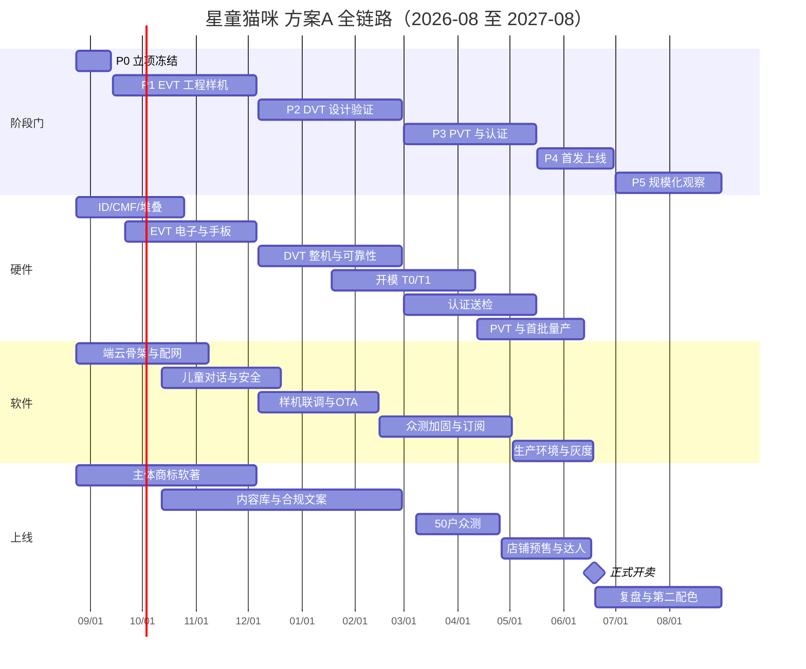

# 星伴锦程 · 星童猫咪  
全链路开发时间计划表（硬件 / 软件 / 上线）

| 字段 | 内容 |
| --- | --- |
| 版本 | v1.0 |
| 编制日期 | 2026-08-23 |
| 计划起点 | 2026-08-24（周一） |
| 首发开卖目标 | **2027-06-18** |
| 规模化观察窗口 | 2027-06-19 ～ 2027-08-31 |
| 配套表格 | [星童猫咪-开发时间计划表.xlsx](./星童猫咪-开发时间计划表.xlsx) |

---

## 0. 怎么读这份计划

这是一份把 **硬件量产、软件可用、合规上架、电商开卖** 四条线拉到同一时间轴上的执行表，不是融资 BP 摘要。

两份源材料（`星伴锦程商业计划书.pptx`、`星童猫咪.pptx`）位于本机微信缓存，云端读不到原文。本表按「儿童 AI 陪伴毛绒猫 + 家长端 + 云端对话 + 硬件一次性收入 / 算力订阅」的标准产品结构编排。收到 PPT 后，优先回填这 6 项，日程可以按周缩放，不必重写框架：

1. 首发年龄段与使用场景  
2. 目标零售价与 BOM 上限  
3. 机构方案：自研主板还是外购模组 + OEM 公模  
4. 首发渠道（天猫 / 抖音 / 私域 / 幼儿园渠道）  
5. 团队编制与外包边界  
6. 融资或自有资金能撑到哪一个里程碑  

---

## 1. 产品范围（本计划默认冻结）

**一句话：** 星童猫咪是星伴锦程的首款儿童 AI 陪伴硬件——一只会说话、能被抱着的猫，家长用微信小程序管时长和内容。

| 层 | 首发做 | 首发不做 |
| --- | --- | --- |
| 硬件 | 毛绒猫身、触摸、麦克风 + 喇叭、Wi-Fi、Type-C 充电、1 个生命感执行器（震动或轻微点头） | 四足行走、复杂舵机表情、视觉摄像头（儿童隐私风险高，二期再评） |
| 软件 | 唤醒对话、讲故事 / 儿歌 / 百科、情绪安抚、离线兜底、OTA、家长端时长与内容开关 | 开放式社交、自动加好友、不受控生成式视频 |
| 商业 | 硬件销售 + 年订阅（对话算力 / 内容包） | 先做免费无限聊再找变现 |
| 合规 | 玩具安全、无线电、电池、儿童个人信息、内容安全 | 未完成认证就公开售卖 |

建议首发年龄：**3–8 岁**（家长强控制）。2 岁及以下只做安抚音，不做开放问答。

---

## 2. 两条节奏，先选一条

| 方案 | 周期 | 硬件路径 | 适合 | 首发日 |
| --- | --- | --- | --- | --- |
| **A. 标准自研（默认）** | 约 42 周 | 自研 ID/结构/主板，三轮样机（EVT→DVT→PVT），开模 + 认证后量产 | 要自有外观、可迭代、可控毛利 | **2027-06-18** |
| **B. 轻硬件加速** | 约 28 周 | 外购对话模组 + 毛绒 OEM / 小改公模，软件先行 | 先验证内容和付费，再开模 | **2027-03-20** |

下面正文按 **方案 A** 展开。方案 B 的压缩方法见第 9 节。Excel 里两套里程碑都有。

**关键原则：**

1. **软件必须早于硬件。** 第 10 周就要有可对话的云 + 小程序，第 16 周必须能装进 EVT 样机。  
2. **认证和模具是硬件关键路径，不能靠加班压缩。**  
3. **上线不是写完代码，而是：认证过、内容过、客服过、物流过、家长同意过。**  
4. **先 50 户真孩子众测，再公开预售。** 儿童产品口碑一次定生死。

---

## 3. 总时间轴



---

## 4. 里程碑门禁（不通过不准进入下一阶段）

| ID | 日期 | 名称 | 必须同时满足 |
| --- | --- | --- | --- |
| M0 | 2026-09-13 | 立项冻结 | 年龄段、零售价、BOM 上限、硬件路径（A/B）、首发渠道、预算签完 |
| M1 | 2026-11-08 | 软件可对话 | 云端问答可跑通；家长小程序能绑定虚拟设备；儿童安全过滤器有黄金集 |
| M2 | 2026-12-06 | EVT 过关 | 手板能唤醒、对话、触摸反馈、充电；续航与发热有数据；问题清单关闭或转入 DVT |
| M3 | 2027-02-28 | DVT 过关 | 10–20 台结构件整机；跌落 / 按压 / 线材 / 按键寿命达标；人设与延迟家长可接受 |
| M4 | 2027-04-25 | 众测过关 | ≥50 个真实家庭用满 14 天；日活对话、投诉、安全事件有数；致命问题为 0 |
| M5 | 2027-05-16 | 认证与 PVT | GB 6675、无线电、电池资料齐；PVT 良率与工时可量产；说明书 / 隐私政策定稿 |
| M6 | **2027-06-18** | **正式开卖** | 首批到仓、店铺上架、客服排班、OTA 回滚演练通过、预售履约名单锁定 |
| M7 | 2027-08-31 | 规模化观察 | 30 天退货率、复购/订阅转化、售后工单、内容事故有月报；决定是否开第二配色 / 开模二代 |

---

## 5. 三线对照（按月）

| 月份 | 硬件 | 软件 | 上线 / 合规 |
| --- | --- | --- | --- |
| **2026-08 末～09** | 场景冻结、竞品拆机、ID 三套、电子架构、寻源启动 | 技术栈、账号与设备模型、配网协议、对话最小链路 | 主体、商标检索、域名、隐私政策草稿、儿童数据分类 |
| **2026-10** | ID 选定、堆叠、CMF 打样、EVT 原理图 | ASR–安全–LLM–TTS 打通、人设 v0、离线兜底词库 | 软著材料、内容分级标准、竞品合规对标 |
| **2026-11** | EVT PCB、贴片、手板贴绒 | **M1：小程序绑定 + 对话**、评测集 100 条 | 品牌 VI、官网骨架、算法/APP 备案路径确认 |
| **2026-12** | **M2：EVT 整机**、问题清单、DVT 改版开干 | 装机联调、唤醒误触、AEC | 种子家庭 10 户（团队子女 / 亲友） |
| **2027-01** | DVT 结构、开模启动、可靠性用例 | OTA、低功耗、记忆 v1、内容 CMS | 拍摄脚本、详情页信息架构、定价测算 |
| **2027-02** | **M3：DVT 10–20 台**、T0 模具 | 延迟 / 打断 / 降级、家长报告 | 内容库首发量、客服知识库初稿 |
| **2027-03** | 认证送检、T1 修模、PVT 备料 | 众测包、用量与订阅、审计日志 | **50 户众测开始**、店铺资质 |
| **2027-04** | T1 确认、PVT 组装 | 众测缺陷关闭、压测、回滚 | **M4：众测报告**、预售页、达人测品 |
| **2027-05** | **M5：认证齐、PVT 良率**、产线 SOP | 生产环境、监控告警、灰度开关 | 说明书定稿、物流仓、客服排班 |
| **2027-06** | 首批入库、抽检 | 开卖日值班、限流 | **M6：6/18 开卖**、履约、舆情值班 |
| **2027-07～08** | 售后备件、第二配色评估 | 人设与内容迭代、成本优化 | **M7：数据复盘**、是否扩产 |

---

## 6. 硬件计划（关键路径）

硬件决定开卖日。软件再快，没有认证整机也不能卖。

### 6.1 产品与外观（P0–P1）

- 冻结：体量（建议约 18–22 cm，单手可抱）、重量（建议 ≤ 450 g）、可水洗策略（外套可拆 vs 整机不可洗）。  
- ID 出 3 套：偏幼态奶猫 / 偏星空科幻 / 偏家猫写实。只选 1 套进入手板，禁止「三套都做量产」。  
- 生命感执行器首发只留 **1 路**（肚皮轻震或头部小幅度点头）。耳朵 + 尾巴多舵机放到二代，否则模具、可靠性、成本会同时爆。  
- **不做前摄。** 儿童卧室摄像头会把合规和家长信任一起做难。

### 6.2 电子与三轮样机

| 轮次 | 数量 | 目的 | 完成标志 |
| --- | --- | --- | --- |
| EVT | 5–8 台 | 电性能、声学、对话能不能在真机器上成立 | 能稳定唤醒并完成 10 轮对话；充电与发热有记录 |
| DVT | 10–20 台 | 结构、可靠性、体验 | 1 米跌落、按压、线材摆动、按键 5000 次；家长盲测「愿意让孩子抱着睡」 |
| PVT | 50–100 台 | 工艺、工时、良率 | 产线不靠工程师手改；抽检通过；其中 50 台可进众测 |

### 6.3 认证（必须提前排队）

| 项目 | 为何要 | 建议启动 |
| --- | --- | --- |
| GB 6675 玩具安全 | 毛绒、小零件、填充物、化学 | DVT 结构冻结后立刻 |
| CCC（如适用） | 带电玩具 / 电源 | 与 6675 同期 |
| SRRC / 无线电 | Wi-Fi / 蓝牙 | EVT 射频方案冻结后 |
| 电池 UN38.3 + 空运 | 电商发货、补货 | 电芯选型时同步 |
| 包装与说明书 | 年龄警示、充电安全、家长监护 | PVT 前定稿 |

认证周期按 **8–12 周** 预留，不按「加急两周」赌开卖日。

### 6.4 供应链与首批

- 毛绒 OEM、电子 OEM、模具厂 **各至少 2 家对比**，P1 结束前签意向。  
- 首批量建议 **500–2000 台**，不要一上来 1 万台。儿童硬件的真实退货和毛绒瑕疵要靠首批付钱学习。  
- 售后备件：主板、喇叭、充电线、可拆外套与包装，按首批 5% 预留。

---

## 7. 软件计划（必须领先硬件）

软件分四层，禁止做成「一个大模型 API + 喇叭」。

```text
家长小程序 / CMS
        ↓
云端：账号 · 设备 · 对话编排 · 安全 · 记忆 · 内容 · 订阅 · 观测
        ↓
设备固件：配网 · 唤醒 · 录音播放 · OTA · 低功耗 · 离线兜底
        ↓
星童猫咪人设 + 儿童安全策略 + 评测集
```

### 7.1 按列车交付（与硬件门禁对齐）

| 列车 | 窗口 | 交付 | 完成定义 |
| --- | --- | --- | --- |
| S1 骨架 | ～2026-11-08 | 账号、设备、配网协议、ASR–LLM–TTS、小程序绑定 | 手机当假设备也能聊；**M1** |
| S2 儿童可用 | ～2026-12-20 | 人设、安全过滤、离线句、打断、评测集 200 条 | 不回答危险问题；能讲完一个故事 |
| S3 装机 | ～2027-02-14 | 真机 AEC、唤醒、OTA、休眠、记忆 v1 | EVT/DVT 上不掉线、能升级 |
| S4 众测加固 | ～2027-05-02 | 订阅、审计、压测、回滚、家长日报 | 50 户不出现未拦截的高危回复 |
| S5 生产环境 | ～2027-06-18 | 监控、限流、值班、灰度 | 开卖日可一键关对话、只留离线安抚 |

### 7.2 儿童安全（不可裁）

- 开放问答必须过 **输入过滤 + 输出过滤 + 主题白名单**。  
- 涉及身体、陌生人、地址、药物、自伤，一律短拒答并提示找家长。  
- 全量对话可审计，保存周期与家长删除权写进协议。  
- 未完成黄金集（建议 ≥200 条儿童真实问法）之前，禁止对外众测。

### 7.3 家长端最小集

首发只做这 6 个页面，多了会拖死 M1：

1. 扫码绑定 / 解绑  
2. 每日可用时长与宵禁  
3. 内容开关（闲聊 / 故事 / 百科 / 儿歌）  
4. 当日摘要（聊了什么主题，不默认回放全部原文）  
5. 固件版本与更新  
6. 隐私与「删除孩子数据」

---

## 8. 上线计划（开卖日当天要齐的东西）

「上线」在本项目里等于 **把一台合格的猫交到家长手里，并且对话服务当天不崩**。

### 8.1 合规与主体（P0 就开始，不要等到 5 月）

- 公司主体、对公、商标「星伴锦程」「星童猫咪」检索与申请。  
- 软件著作权、外观专利（开模前）。  
- 儿童个人信息保护：家长同意、最小必要、单独同意、删除/导出。  
- 生成式 AI / APP / 小程序备案路径在 11 月确认，该排队的立刻排队。  
- 隐私政策、用户协议、年龄提示、充电安全页与包装一并冻结。

### 8.2 内容与品牌

- 首发内容库建议：故事 80、儿歌 40、百科卡片 120、安抚话术 60。全部人审。  
- 详情页只承诺已做的能力，不写「无限陪伴」「替代家长」。  
- 拍摄用 DVT/PVT 真机，不用效果图开卖。

### 8.3 从种子到开卖

| 批次 | 时间 | 人数 | 目的 |
| --- | --- | --- | --- |
| 种子 | 2026-12 | ～10 户 | 看孩子是否愿意抱、是否怕声音 |
| 众测 | 2027-03-08～04-25 | ≥50 户 | 看安全、续航、毛绒脏污、家长是否愿意付订阅 |
| 预售 | 2027-05 起 | 视产能 | 锁需求、测详情页、不超卖首批 |
| **开卖** | **2027-06-18** | 首批 500–2000 | 履约 + 舆情 + 售后 |

### 8.4 开卖日检查单（M6）

- [ ] 认证与检测报告可对外出示  
- [ ] 首批已入仓并抽检  
- [ ] 小程序审核通过，OTA 回滚演练成功  
- [ ] 对话限流与「紧急只留离线安抚」开关可用  
- [ ] 客服排班、退换货、物流保价  
- [ ] 预售名单与发货波次  
- [ ] 舆情值班（开卖后 14 天）

---

## 9. 方案 B：轻硬件 28 周怎么压

若 PPT 里明确是「先卖内容、硬件用模组」，把开卖日提前到 **2027-03-20**，只改硬件路径，软件和合规不删：

| 砍掉 / 外购 | 保留 |
| --- | --- |
| 自研主板、三轮开模 | 外购语音模组 + 毛绒 OEM / 小改公模 |
| 复杂 ID 与多执行器 | 固定造型 + 1 路震动 |
| DVT 20 台自研结构 | 模组厂提供的认证参考 + 整机复检 |

即使走 B，**50 户众测、儿童安全过滤器、玩具与电池合规** 仍不能少。B 方案的风险是外观同质、毛利薄、二代还得重开模。

---

## 10. 编制与双周节奏

建议最小编制（创业团队，部分岗位外包）：

| 角色 | 人数 | 主责 |
| --- | --- | --- |
| 产品 / 项目 | 1 | 门禁、范围、众测、开卖检查单 |
| 硬件项目（可兼供应链） | 1 | 样机、模具、认证、良率 |
| ID / CMF | 外包 | 外观与面料 |
| 结构 | 外包 | 堆叠、模具 |
| 电子 / 嵌入式 | 1 | 原理图、固件、声学 |
| 后端 + AI 应用 | 1–2 | 对话、安全、记忆、观测 |
| 小程序 | 1 | 家长端 |
| 内容 / 运营 | 1 | CMS、审核、社群、客服 SOP |

**双周节奏：** 第 1 天冻结切片；第 2–8 天做；第 9 天联调；第 10 天演示并对门禁。演示必须是真机或真小程序，不接受只讲 PPT。

---

## 11. 关键路径与风险

**关键路径（方案 A）：**  
外观冻结 → EVT 电声 → DVT 结构 → **开模** → 认证 → PVT 良率 → 入库 → 开卖。

软件不在关键路径上，但 **M1 若延期超过 3 周，EVT 会变成「不会说话的毛绒」，后面所有体验结论作废。**

| 风险 | 影响 | 缓释 |
| --- | --- | --- |
| 认证排队 | 开卖日整体后移 | 3 月第一周必须送检；预留 8–12 周 |
| 模具 T1 反复 | 4–6 周 | 开模前 DVT 结构冻结，禁止边开模边改脸 |
| 儿童安全事件 | 下架 / 舆情 | 过滤器 + 黄金集 + 一键关对话 |
| 续航 / 发热 | 退货 | EVT 就测，不把续航留到 PVT |
| 毛绒污损与过敏 | 差评 | 面料检测、外套可拆、护理说明 |
| 大模型成本 | 订阅做不平 | 本地唤醒、短回复、日封顶、精力值 |
| 摄像头范围蔓延 | 合规灾难 | 首发写进 Won't：无前摄 |
| PPT 范围膨胀 | 全线延期 | 多舵机、视觉、多语种全部二期 |

缓冲：P2 与 P3 各含 **2 周** 显式缓冲，专给模具和认证，不给新功能。

---

## 12. 本周就该启动的 10 件事（2026-08-24 当周）

1. 把两份 PPT 的关键页导出：定价、年龄、渠道、是否自研主板。  
2. 签 M0 一页纸：范围、Won't、BOM 上限、开卖日。  
3. 选定方案 A 或 B。  
4. 启动商标检索。  
5. 约 2 家毛绒厂、2 家电子 / 模组厂。  
6. 冻结技术栈：端侧芯片、云、ASR/TTS、LLM 网关。  
7. 列出儿童安全黄金集的前 50 条问法。  
8. 注册域名，起草隐私政策目录。  
9. 定双周演示日，钉死到日历。  
10. 用配套 Excel 建任务看板，状态只允许：未开始 / 进行中 / 阻塞 / 完成。

---

## 13. 配套文件

| 文件 | 用途 |
| --- | --- |
| [星童猫咪-开发时间计划表.xlsx](./星童猫咪-开发时间计划表.xlsx) | 开会、排期、周更状态的主表 |
| 本 Markdown | 原则、门禁、范围、风险，给决策用 |

Excel 工作表：

1. **封面与假设** — 方案 A/B、默认范围  
2. **里程碑门禁** — M0–M7  
3. **月度三线甘特** — 2026-08 至 2027-08  
4. **全量任务清单** — 硬件 / 软件 / 上线，可筛选  
5. **硬件任务**  
6. **软件任务**  
7. **上线与合规任务**  
8. **人员与决策**  
9. **风险与缓冲**  

状态更新时只改 Excel「状态 / 实际开始 / 实际结束 / 备注」，不要改里程碑日期，除非门禁评审正式改期。
